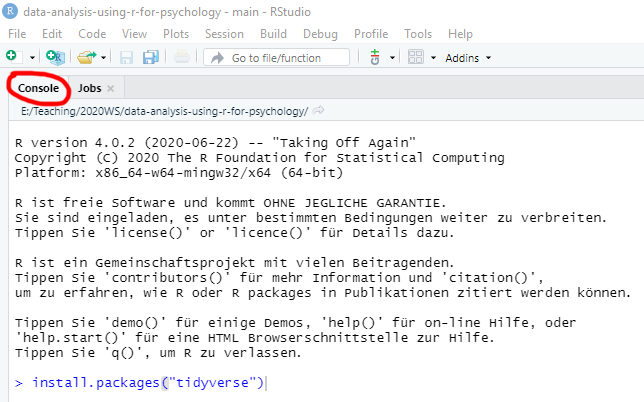
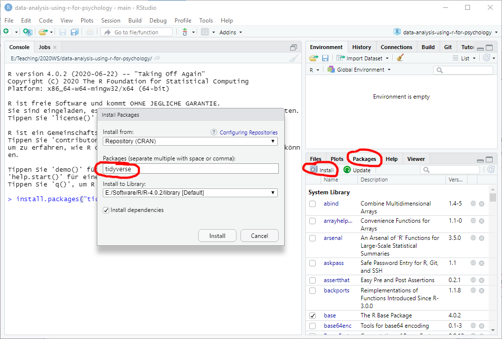
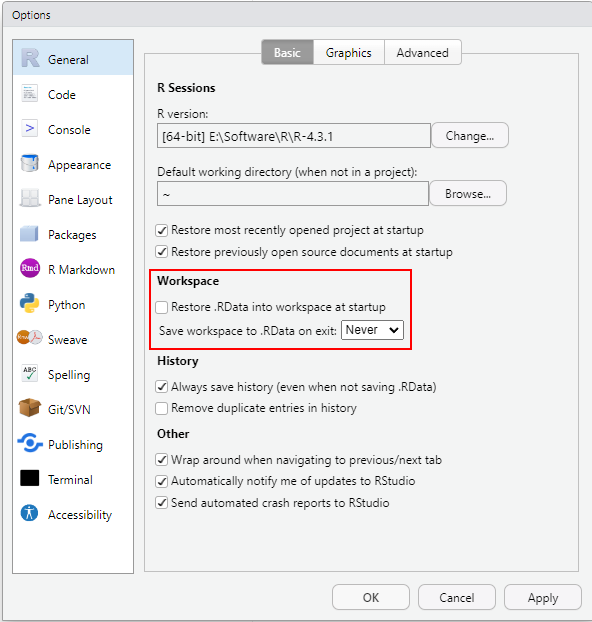

# Software {#software -}

## Installing R {- #install-r}

Go to [r-project.org](https://cloud.r-project.org/) and download a current stable version of R for your platform. Run the installer, accepting all defaults.

## Installing R-Studio {- #install-rstudio}
Go to [posit.co](https://posit.co/download/rstudio-desktop/) and download _RStudio Desktop_ edition for your platform. Install it using defaults. The _R-Studio_ is an integrated development environment for R but you need to install R separately first! The R-Studio will automatically detect latest R that you have and, in case you have several versions of R installed, you will be able to alter that choice via _Tools / Global Options..._ menu.

I will explain the necessary details on using R-Studio throughout the seminar but the [official cheatsheet](https://rstudio.github.io/cheatsheets/html/rstudio-ide.html) is an excellent, compact, and up-to-date source of information. In fact, R Studio has numerous [cheatsheets](https://posit.co/resources/cheatsheets/) that describe individual packages in a compact form.

## Installing RTools {- #install-rtools}
If you are using Windows, you might need [Rtools](https://cran.r-project.org/bin/windows/Rtools/) for building and running some packages. You do not need to install it at the beginning, but if you will need it later, just following the link above, download the latest _Rtools_ version, run the installer using the _defaults_ and follow the instructions on that page to put Rtools on the PATH!

## Installing packages {- #install.packages}
The real power of R lies in a vast community-driven family of packages suitable for any occasion. The default repository used by R and R-Studio is [The Comprehensive R Archive Network](https://cran.r-project.org/) (a.k.a. _CRAN_). It has very strict requirements for submitted packages, which makes it very annoying for the authors but ensures high quality for you. We will use CRAN as a sole source of packages. However, there are alternatives, such as [Bioconductor](http://www.bioconductor.org/) that might have a package that is missing on [CRAN](https://cran.r-project.org/). The Bioconductor relies on its own package manager, so you will need to consult the latest manual on their website.

To install a CRAN package you have two alternatives: via command line function or via R-Studio package manager interface (which will call the function for you). In the former case, go to _Console_ tab and type `install.packages("package-name")`, for example `install.packages("tidyverse")`, and press **Enter**.

```{r echo=FALSE, out.width = "100%", fig.align = 'center'}

```

Alternatively, go to _Packages_ tab, click on _Install_ button, enter a package name in the window (it has autocomplete to help you), and press _Install_.

```{r echo=FALSE, out.width = "100%", fig.align = 'center'}

```

Sometimes, R will ask whether you want to install packages from source. In this case, it will grab the source code and compile the package, which takes time and requires [RTools](#install-rtools). In most cases, you can say "No" to install a pre-build binary version. The binary version will be slightly outdated but the emphasis is on _slightly_.

On other occasions, R-Studio will suggest restarting R Session as packages that need to be updated in use. You can do that but, in my experience, this could become a repetitive experience if one of the packages is used R Studio itself (so it starts it in a new session, realizes that it is in use, suggests to restart the session, etc.) My solution is to close _all_ R Studio windows and use R directly. For Windows, you can find it the Start Menu, just make sure that you are using the correct version. Then, I use `install.packages()` to install and update everything I need.

## Minimal setup of R-Studio
A big advantage of R-Studio is that it comes as a turn-key solution with reasonable default settings. However, there is one convinience feature that I strongly recommend turning off: automatic storing and saving of the workspace. Go to _Tool / Global Options..._ and in _General_ setting tab unselect "Restore .RData into workspace at startup" and set "Save workspace to .RData on exit:" to _Never_. 

```{r echo=FALSE, out.width = "100%", fig.align = 'center'}

```

The feature that you just turned off sounds great on paper: When it is enabled the entire workspace (state of the program) is saved and automatically restored when you start RStudio again. Very convenient, as you start off at the same state, with same loaded libraries and variables/tables/functions as you have left. However, in my experience, the price you pay is that you may no longer remember how did you get to that state, as it is common to try out things while writing and editing the analysis. This leaves libraries that are loaded (but not explicitly in the code), variables created or modified by hand (with no trace of this in the program), etc. So while things will continue to work on your computer, same notebook or code will fail on a different one. And debugging problems like these is one of the toughest cases taking me ages to solve every time I make a mistake like that. The price you pay is that all the computation must be repeated but the advantage of it is that it gives you another opportunity to check that analysis works as it should and your previous results were not a fluke.

## Minimal set of packages {-}
Please install the following packages:

* `tidyverse` : includes packages from data creation (`tibble`), reading (`readr`), wrangling (`dplyr`, `tidyr`), plotting (`ggplot2`). Plus type specific packages (`stringr` for strings, `forcats` for factors) and functional programming (`purrr`).
* `rmarkdown` : package for working with RMarkdown notebooks, which will we use to create reproducible analysis.
* `fs` : file system utilities.

## Keeping R and packages up-to-date {- #installr}
R and packages are getting constantly improved, so it is a good idea to regularly update them. For packages, you can use _Tools / Check for Packages Updates..._ menu in R-Studio. On Windows, to update R and, optionally, packages, you can use [installr](https://www.r-project.org/nosvn/pandoc/installr.html) package that can install newest R (but it keeps old version!) optionally copying your entire library of packages, updating packages, etc. It is easy to use even in R itself, as it creates an extra menu to make interface simpler. For R-Studio itself, use _Help / Check for Updates_ menu and install a newer version, if it is available (it is generally a good idea to keep your R-Studio in the newest state).
