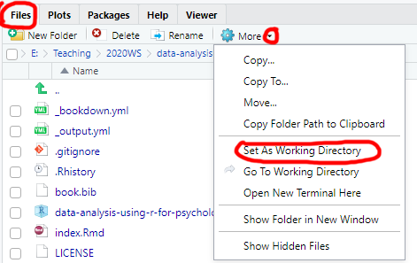
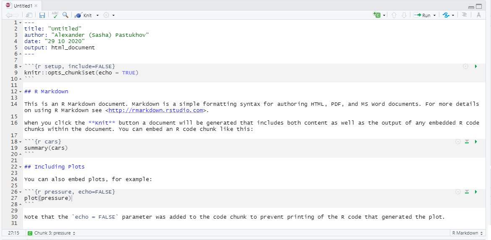
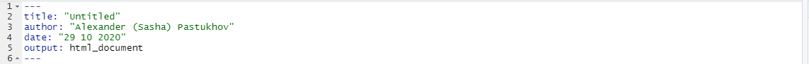
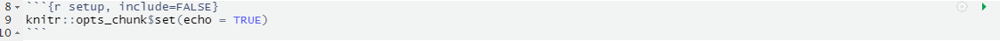
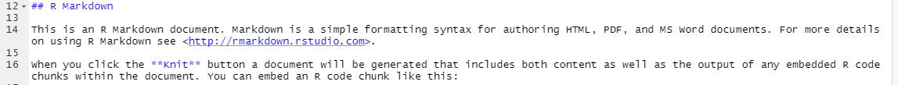
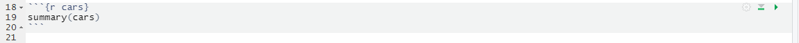
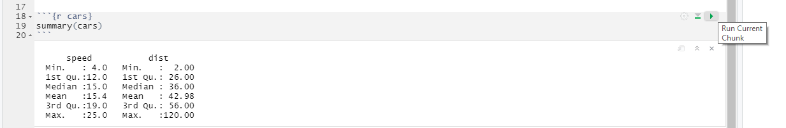

# Reproducable Research: Projects and RMarkdown Notebooks {#reproducable-research}

Our aim is create reproducible research and analysis. It is a crucial component of the open science movement but is even more important for your own research or study projects. Doing analysis is easy. The trick is to create a self-contained well-documented easy-to-understand reproducible analysis. An analysis that others and future-you can easily understand gives you a deeper insight into the results (less mystery is better in these cases) and makes it easier to communicate them to other researchers or fellow students.

## Projects {#projects}
One of the most annoying features of R is that sees files and folders only relative to its "working directory", which is set via [setwd(dir)](https://www.rdocumentation.org/packages/base/versions/3.6.2/topics/getwd) function. What makes it particularly confusing, is that your currently open file may be in some other folder. If you simply use `File / Open`, navigate to that file and open it, it does not change your working directory. Similary, in R-Studio you can navigate through file system using `Files` tab and open some folder you are interested in but that **does not make it a working directory**. You need to click on `More` and `Set As Working Directory` to make this work.

```{r echo=FALSE, out.width = "100%", fig.align = 'center'}

```

In short, you may feel that you are working in a particular folder but R will have its own ideas about this. Whenever this happens, it is really confusing. To avoid this you should organize any separate project or seminar as an _R Project_. It assumes that all the necessary files are in the project folder, which is also the working directory. R Studio has some nice project-based touches, like keeping tracking of which files you have open, providing version control, etc. Bottom line, **always** create a new R-project to organize yourself, even if it involves just a single simple file to try something out, because "Nothing is more permanent than a temporary solution!" (which is why you should **always** write your code, as if it is for the long term project, otherwise your temporary solution grows into incomprehensible spaghetti code).

Let us create a new project for this seminar. Use `File / New Project...`, which will give you options of creating it in a new directory (you get to come up with a name), using an existing directory (project will be named after that directory), or check it out from remote repository (something we won't talk about just yet). You can do it either way but this will be the project folder for this seminar and you will need to put all notebooks and external data files into that folder. Next time you need to open it, you can use `File / Recent Projects` menu, `File / Open Project...` menu or simply double-click on the `<name-of-your-project>.Rproj` file in that folder.


## RMarkdown {#rmarkdown}
[RMarkdown notebooks](https://rmarkdown.rstudio.com/) combine formatted text and illustrations with code. When the notebook is "knitted", all the code is ran and its output, such as tables and figures, is inserted into the final document. This allows you to combine the narrative, explaining the background,  the methodology, and conclusion with the actual code that implements what you described.

Importantly, notebook can be knitted into a variety of formats including HTML, PDF, Word document, EPUB book, etc. Thus, instead of creating plots and tables separately to copy-paste them into your Word file (and then redoing it, if something changed, and trying to find the correct code that you used the last time, and wondering why it does not run anymore...), you simply "knit" the notebook and get the current and complete research report, semester work, presentation, etc. Even more importantly, same goes for others, as they also can knit your notebook and generate its latest version in format they need. All your exercises will be based on RMarkdown notebooks, so you need to familiarize yourself with them. 

We will start by learning the markdown, which is a family of human-oriented markup languages. Markup is the plain text that includes formatting syntax and can be translated into "reach" visually formatted text. For example, HTML and LaTeX are markup languages. The advantage of markup is that you do not need a special program to edit it, any plain text editor will suffice. You need a special program to turn this plain text into the document (for example,  Latex to compile a PDF or a browser to view HTML properly) but anyone can read your original file even if they do not have Latex, PDF reader, or a browser installed (you do need Word to read a Word file). **Markdown** markup language was design to make formatting simple and unobtusive, so the plain document is easy to read (you can reading HTML but it is hardly fun!). It is not as feature-rich as HTML or LaTeX but covers most of your usual needs and is very easy to learn!

Create a new markdown file via `File / New File / R Markdown...` menu. Use `Seminar 1` for its title and HTML as default output format. Then you need to save the file (pressing `Ctrl + S` will suffice) and call the file `seminar-01` (R Studio will add `.Rmd` extension automatically). The file you created is not empty, as R Studio is kind enough to provide a template and example for you. Knit the notebook by clicking on `Knit` button or pressing `Ctrl + Shift + K` to see how the properly typeset text will look like (it will appear in `Viewer` tab).

```{r echo=FALSE, out.width = "100%", fig.align = 'center'}

```

Let us go through the default notebook that R Studio created for us. 

```{r echo=FALSE, out.width = "100%", fig.align = 'center'}

```

The top part between two sets of `---` is a notebook header with various configuration options written in [YAML](https://yaml.org/) (yes, we have two different markup languages in one file). `title`, `author`, and `date` should be self-explanatory. `output` defines what kind of output document knitr will generate. You can specify it by hand (e.g., `word_document`) or just click on drop down next to `Knit` button and pick the option you like (we will use the default HTML most of the time). These are sufficient for us but there are numerous other options that you can specify, for example, to enable indexing of headers. You can read about at [yihui.org/knitr](https://yihui.org/knitr/).

```{r echo=FALSE, out.width = "100%", fig.align = 'center'}

```

The next section is the "setup code chunk" that specifies default options on how the code chunks are treated (executed or not, their output is shown or not, etc.). By default code in chunks is run and its output is shown (`echo = TRUE`) but you can change this behavior on per-chunk basis by pressing the gear button at the top-right. The setup chunk is also a good place where to import your libraries (we will talk about it later) as it is always run before any other chunks (so, even if you forgot to run it to load libraries, R Studio will do this for you).

```{r echo=FALSE, out.width = "100%", fig.align = 'center'}

```

Next, we have plain text with rmarkdown, which get translated into formatting when you click on `Knit` button. You can write like this anywhere outside of code chunks to explain the logic of your analysis. You should write why and how the analysis is performed but leave technical details to the chunk itself, where you can comment the code. Minimally, I use it to provide a brief explanation about the upcoming figures or tables, e.g. "Compute accuracy per observer and condition. Using binomial mixed models to test for the effect of condition".

```{r echo=FALSE, out.width = "100%", fig.align = 'center'}

```

Finally, we have our first "proper" chunk of code (the "setup" chunk above is a special case). A code chunk is simply the code embedded between 
` ```{r <name of the chunk} ` and the seconds set of ticks ` ``` `. Here `r` specifies that the code inside is using R language but you can use other languages such as Python, Stan, or SQL. The `name of the chunk` is optional but I would recommend to have it, as it reminds you what this code is about and it makes it easier to navigate in large notebooks. In the bottom-left corner, you can see which chunk or section you are currently at and, if you click on it, you can quickly navigate to a different chunk. If chunks are not explicitly named, they will get labels `Chunk 1`, `Chunk 2`, etc. making it hard to identify them.

```{r echo=FALSE, out.width = "100%", fig.align = 'center'}
knitr::include_graphics("images/notebook-navigation.png")
```

There are also additional options that you can specify per chunk (whether run the code, to show the output, what size the figures should be, etc.). Generally we won't need these options but you can get an idea about them by looking at the [official manual](https://yihui.org/knitr/options/). You can create chunk by hand or click on "Create chunk" drop-down list (in this case, it will create the chunk at the position of the cursor)

```{r echo=FALSE, out.width = "100%", fig.align = 'center'}
knitr::include_graphics("images/notebook-insert-chunk.png")
```

Finally, you run **all** the code in the chunk by clicking on `Run current chunk button` at the top-right corner of the chunk or by pressing `Ctrl + Shift + Enter` when the you are inside the chunk. However, you can also run just a *single line* or only *selected code* by pressing `Ctrl + Enter`. The cool thing about RMarkdown is that you will see the output of that chunk right below it. This means that you can write you code chunk-by-chunk, ensure that each works as intended and only when knit the entire document. Run the chunks in your notebook to see what I mean.

```{r echo=FALSE, out.width = "100%", fig.align = 'center'}

```

## Exercise
For the today's exercise, I want you to familiarize yourself with markdown. Go to [markdownguide.org](https://www.markdownguide.org/) and look at basic and extended syntax (their cheat sheet is also very good). Write any text you want that uses all the formatting and submit the file to MS Teams.


