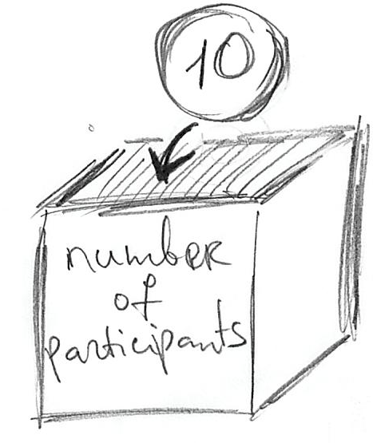
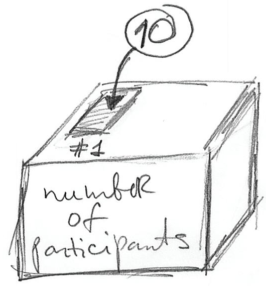
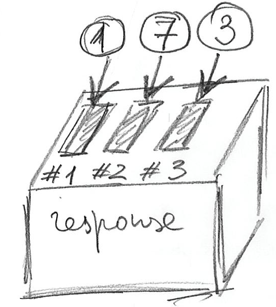
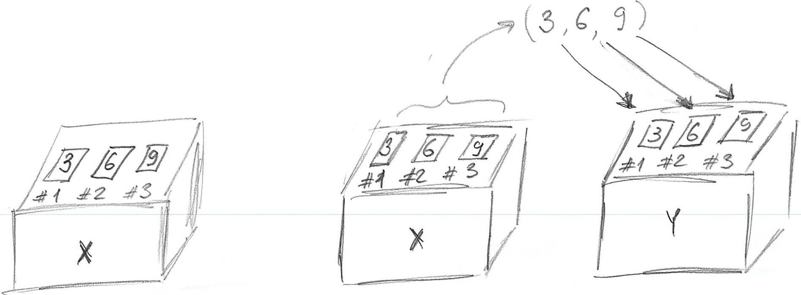

# Vectors! Vectors everywhere! {#vectors}

Before reading the chapter, please download the [exercise notebook](notebooks/Seminar 02 - Vectors.Rmd) (**Alt+Click** to download it or right-click as _Save link as..._), put it into your seminar [project folder](#projects), and open the project. You need both the text and the notebook with exercises to be open, as you will be switching between them.

Before we can start using R for analysis, you need to learn about vectors. This is a key concept in R, so your understanding of it will determine how easy it will be for you to use R in general. Do all of the exercises and do not hesitate to ask me whenever something is unclear. Remember, you need to master vectors before you can master R!

## Variables as boxes {#variables}

In programming, a concept of a variable is often described as a box you can put something in. A box has a name tag on it, which is the _name_ of the variable. Whatever you put in is the _value_ that you store. 

```{r echo=FALSE, out.width = "30%", fig.align = 'center'}

```

This "putting in" concepts is reflected in R syntax
```{r eval=FALSE}
number_of_participants <- 10
```
Here, `number_of_participants` is the name of the variable (name tag for the box that we will be using), `10` is the value you store, and `<-` means _"put `10` into variable `number_of_participants`"_. If you know other programming languages, you probably expected the usual assignment operator `=`. Confusingly, you can use it in R as well, but there are some subtle, yet important, [differences](https://stat.ethz.ch/R-manual/R-devel/library/base/html/assignOps.html) in how they operate behind the scenes. We will meet `=` again when we will be talking about functions and, in particular, Tidyverse way of doing things but for now **only use `<-` operator**!

## Assignment statement in detail {#assignment-statement}
One _very important_ thing to remember about the assignment statement `<variable> <- <value>`:  The _right side_ is evaluated first until the final value is established and then, and only then, it is stored in a `<variable>` specified on the left side. This means that you can use the same variable on _both_ sides. Take a look at the example
```{r}
x <- 2
print(x)
x <- x + 5
print(x)
```
We are storing value `2` in a variable `x`. In the next line, the _right side_ is evaluated first. This means that the current value of `x` is substituted in its place on the right side: `x + 5` becomes `2 + 5`. This expression computed and we get `7`. Now, that the _right side_ is fully evaluated, the value can be stored in `x` replacing (overwriting) the original value it had.

R's use of `<-` makes it easier to memorize this _right side is fully evaluated first_ rule. However, as noted above, we will meet `=` operator and this one makes it look like a mathematical equation. However, assignments (storing values in a variable) have nothing in common with mathematical equations (finding values of variables to ensure equality)!

::: {.infobox .practice}
Do exercise 1.
:::

## Vectors and singluar values (scalars, which are also vectors) {#vectors-scalars}

The box metaphor you've just learned, doesn't quite work for R. Historically, R was developed as a language for statistical computing, so it was  based on concepts of linear algebra instead of being a "normal" programming language like Python or C. This means that there is no conceptual divide between single values and containers (arrays, lists, dictionaries, etc.) that hold many single values. Instead, the primary data unit in R is a _vector_, which you may remember from geometry or, hopefully, from linear algebra, as an arrow that goes from 0 to a specific point in space. From computer science point of view, a vector is just a list of numbers (or some other values, as you will learn later). This means that there are no "single values" in R, there are only vectors of variable length. Special cases are vectors of length one,  which are called _scalars_ ^[Multiplication of a vector by another vector _transforms_ it but for a single element vector the only transformation you can get is "scaling", hence, the name.] (but they are still vectors) and zero length vectors that are, sort of, a Platonic idea of a vector without actual values. With respect to the "box metaphor", this means that we always have a box with indexed (numbered) slots in it. A simple assignment makes sure that "the box" has as many slots as values you want to put in and stores these values one after another starting with slot #1^[If you have experience with programming languages like Python, C, or Java: indexes in R start with 1, not with 0.]. Therefore, the example above `number_of_participants <- 10` creates a _vector_ variable with one (1) slot and stores the value in it.

```{r echo=FALSE, out.width = "30%", fig.align = 'center'}

```

But, as noted above, a single value (vector with length of one) is a special case. More generally you write:
```{r eval=FALSE}
response <- c(1, 7, 3)
```

Here, you create a variable (box) named `response` that has three slots in it because you want to store three values. You put values `1`, `7`, `3` into the slots #1, #2, and #3. The `c(1, 7, 3)` notation is how you create a vector in R by [**c**oncatenating](https://www.rdocumentation.org/packages/base/versions/3.6.2/topics/c) (or **c**ombining) values^[I find this to be a very poor choice of name but we are stuck with it, so your only option is to get used to it.]. The figure below illustrates the idea:

```{r echo=FALSE, out.width = "30%", fig.align = 'center'}

```

Building on the box metaphor: If you can store something in a box, you can take it out! In the world of computers it works even better, because rather than taking something out, you just make a copy of that and store this copy somewhere else or to use it to compute things. Minimally, we would like to see what is inside of the box. For this, you can use [print](https://stat.ethz.ch/R-manual/R-devel/library/base/html/print.html) function:

```{r}
response <- c(1, 7, 3)
print(response)
```

Or, we can make a copy of values in one variable and store them in another:
```{r}
x <- c(3, 6, 9)
y <- x 

print(x)
print(y)
```
Here, we create a 3-slot variable `x` so that we can put in a vector of length 3 created via concatenation `c(3, 6, 9)`. Next, we make a copy of these three values and store them in a different variable `y`. Importantly, the values in variable `x` stayed as they were. Take a look at the figure below, which graphically illustrate this:

```{r echo=FALSE, out.width = "100%", fig.align = 'center'}

```

::: {.infobox .practice}
Do exercise 2.
:::

Remember, everything is a vector! This means that `c(3, 6, 9)` does not concatenate numbers, it concatenates three length one vectors (scalars) `3`, `6`, `9`. Thus, concatenation works on longer vectors in exactly the same way:
```{r}
x <- c(1, 2, 3)
y <- c(4, 5)
print(c(x, y))
```

::: {.infobox .practice}
Do exercise 3.
:::

## Vector indexes (subsetting) {#vector-index}
A vector is an ordered list of values (box with some slots) and, sometimes, you need only one of the values. Each value (slot in the box) has its own index from 1 till N, where N is the [length](https://stat.ethz.ch/R-manual/R-devel/library/base/html/length.html) of the vector. To access that slot you use square brackets `some_vector[index]`. You can both get and set the value for the individual slots the same way you do it for the whole vector.

```{r}
x <- c(1, 2, 3)
# set SECOND element to 4
x[2] <- 4

# print the entire vector
print(x)

# print only the third element
print(x[3])
```

::: {.infobox .practice}
Do exercise 4.
:::

Unfortunately, vector indexing in R behaves in a way that may^[Who am I kidding? Will!] catch you by surprise. Or, even worse, you will not even notice that your indexing does not work and screwes up your analysis. If your vector contains five values, you would expect that an index of `0` (negative indexes are special and will be discussed below) or above `5` generates an error. Not in R! Index of `0` is a special case and produces an _empty vector_ (vector of zero length).
```{r}
x <- c(1, 2, 3)
x[0]
```

If you try to get vector element using index that is larger than vector length (so `6` and above for a 5 element vector), R will return `NA` (["Not Available" / Missing Value](https://stat.ethz.ch/R-manual/R-devel/library/base/html/NA.html)).
```{r}
x <- c(1, 2, 3)
x[5]
```
In both cases, it won't generate an error or even warn you!

When _setting_ a value by index, using `0` will produce no effect, because you are trying to put a value into a vector with no "slots". Oddly enough, this will also generate neither an error nor a warning, so beware!
```{r}
x <- c(1, 2, 3)
x[0] <- 5
print(x)
```

If you set an element with index **larger** than vector length, the vector will be automatically expanded to that length and all the elements between the old values and the new one will be `NA` (["Not Available" / Missing Value](https://stat.ethz.ch/R-manual/R-devel/library/base/html/NA.html)).
```{r}
x <- c(1, 2, 3)
x[10] <- 5
print(x)
```

This may sound too technical but I want you to learn about this because R conventions are so different from other programming languages and, also, from what you would intuitively expect. If you are not aware of these highly peculiar rules, you may never realize that your code is not working properly because, remember, you will never see an error or even a warning! It should also make you more cautious and careful when programming in R. It is a very powerful language that allows you to be very flexible and expressive. Unfortunately, that flexibility means that base R won't stop you from shooting yourself in a foot. Even worse, sometimes you won't even notice that your foot is shot and bleeding because R won't generate either errors or warnings, as in examples above. Good news is that things are far more restricted and consistent in Tidyverse.

::: {.infobox .practice}
Do exercise 5.
:::

You can also use _negative_ indexes. In that case, you _exclude_ the value with that index and return or modify the rest^[People who use Python, please be aware that negatives indexes in R and in Python behave completely differently!].
```{r}
x <- c(1, 2, 3, 4, 5)
# this will return all elements but #3
x[-3] 
```

```{r}
x <- c(1, 2, 3, 4, 5)
# this will assign new value (by repeating length one vector) to all elements but #2
x[-2] <- 10
x
```

Given that negative indexing returns everything **but** the indexed value, what do you think will happen here?
```{r eval=FALSE}
x <- c(10, 20, 30, 40, 50)
x[-10]
```

::: {.infobox .practice}
Do exercise 6.
:::

Finally, somewhat counterintuitively, the entire vector is returned if you do not specify an index in the square brackets. Here, lack of index means "everything". 
```{r }
x <- c(10, 20, 30, 40, 50)
x[]
```

## Names as an Index {#names}
As you've just learned, every slot in vector has its numeric (integer) index. However, this number only indicates an index (position) of a slot but tells you nothing on how it is conceptually different from a slot with a different index. For example, if we are storing width and height in a vector, remembering their order may be tricky: was it `box_size <- c(<width>, <depth>, <height>)` or `box_size <- c(<height>, <width>, <depth>)`? Similarly, looking at `box_size[1]` tells that you are definitely using the _first_ dimension but is it `height` or `width` (or `depth`)? 

In R, you can use [names](https://stat.ethz.ch/R-manual/R-devel/library/base/html/names.html) to supplement numeric indexes. It allows you to add meaning to a particular vector index, something that becomes extremely important when we use it for tables. There are two ways to assign names to indexes, either when you are creating the index via [c()](https://stat.ethz.ch/R-manual/R-devel/library/base/html/c.html) function or, afterwards, via [names()](https://stat.ethz.ch/R-manual/R-devel/library/base/html/names.html) function.

To create named vector via [c()](https://stat.ethz.ch/R-manual/R-devel/library/base/html/c.html) you specify a name before each value as `c(<name1> = <value1>, <name2> = <value2>, ...)`:
```{r}
box_size <- c("width"=2, "height"=4, "depth"=1) 
print(box_size)
```

Note the names appearing above each value. You can now use either numeric index or name to access the value.
```{r}
box_size <- c("width"=2, "height"=4, "depth"=1) 
print(box_size[1])
print(box_size["depth"])
```

Alternatively, you can use [names()](https://stat.ethz.ch/R-manual/R-devel/library/base/html/names.html) function to both get and set the names. The latter works via a _very counterintuitive_ syntax `names(<vector>) <- <vector-with-names>`
```{r}
# without names
box_size <- c(2, 4, 1) 
print(box_size)

# with names
names(box_size) <- c("width", "height", "depth")
print(box_size)

# getting all the names
print(names(box_size))
```

Because everything is a vector, `names(<vector>)` is also a vector, meaning that you can get or set just one element of it.
```{r}
box_size <- c("width"=2, "height"=4, "depth"=1) 

# modify SECOND name
names(box_size)[2] <- "HEIGHT"
print(box_size)
```

Finally, if you use a name that is not in the index, this is like using numeric index larger than the vector length. Just as for out-of-range numeric index, there will be neither error not warning and you will get an `NA` back.
```{r}
box_size <- c("width"=2, "height"=4, "depth"=1) 
print(box_size["radius"])
```

::: {.infobox .practice}
Do exercise 7.
:::

## Slicing  {#vector-index-slicing}
So far we were reading or modifying either the whole vector or just one of its elements. However, the index you pass in square brackets (you've guess it!) is also a vector! Which means that you can construct a vector of indexes the same way you construct a vector of any values (the only restriction is that index values must integers and that you cannot mix negative and positive indexes).
 
```{r}
x <- c(10, 20, 30, 40, 50)
x[c(2, 3, 5)]
```

When constructing a vector index, you can put index values in the order you require (normal ascending order, starting from the end of it, random order, etc.) or use the same index more than once.
```{r}
x <- c(10, 20, 30, 40, 50)
x[c(3, 5, 1, 1, 4)]
```

You can also use several negative indexes to exclude multiple values and return the rest. Here, neither order nor duplicate indexes matter. Regardless of which value you exclude first or how many times you exclude it, you still get _the rest_ of the vector in its default order.
```{r}
x <- c(10, 20, 30, 40, 50)
x[c(-4, -2, -2)]
```

Note that you cannot mix positive and negative indexes as R will generate an error (at last!).
```{r eval=FALSE}
x <- c(10, 20, 30, 40, 50)

# THIS WILL GENERATE AN ERROR: 
# "Error in x[c(-4, 2, -2)] : only 0's may be mixed with negative subscripts"
x[c(-4, 2, -2)]
```

Finally, including zero index makes no difference but generates neither an error nor a warning.
```{r}
x <- c(10, 20, 30, 40, 50)
x[c(1, 0, 5, 0, 0, 2, 2)]
```

You can also use names instead of numeric indexes.
```{r}
box_size <- c("width"=2, "height"=4, "depth"=1) 
print(box_size[c("height", "width")])
```

However, you cannot mix numeric indexes and names. The reason is that a vector can hold only values of one type (more on that next time), so all numeric values will be converted to text (`1` will become `"1"`) and treated as names rather than indexes.

## Colon Operator and Sequence Generation {#colon-sequence}
To simplify vector indexing, R provides you with a shortcut to create a range of values. An expression `A:B` (a.k.a.[Colon Operator](https://stat.ethz.ch/R-manual/R-devel/library/base/html/Colon.html)) builds a sequence of integers starting with `A` and ending with **and including(!)** `B`^[The latter is not so obvious, if you come from Python].
```{r}
3:7
```

Thus, you can use it to easily create an index and, because everything is a vector!, combine it with other values.
```{r}
x <- c(10, 20, 30, 40, 50)
x[c(1, 3:5)]
```

The sequence above is increasing but you can also use the colon operator to construct a decreasing one.
```{r}
x <- c(10, 20, 30, 40, 50)
x[c(5:2)]
```

The colon operator is limited to sequences with steps of `1` (if end value is larger than the start value) or `-1` (if end value is smaller than the start value).  For more flexibility you can use [Sequence Generation](https://stat.ethz.ch/R-manual/R-devel/library/base/html/seq.html) function: `seq(from, to, by, length.out)`. The `from` and `to` are starting and ending values (just like in the colon operator) and you can specify either a step via `by` parameter (as, in "from A to B by C") or via `length.out` parameter (how many values you want to generate, effectively `by = ((to - from)/(length.out - 1)`).
Using `by` version:
```{r}
seq(1, 5, by=2)
```

Same sequence but using `length.out` version:
```{r}
seq(1, 5, length.out=3)
```
You have probably spotted the `=` symbol. Here, it is not an assignment but is used to specify values of parameters when you call a function. Thus, we are still sticking with `<-` **outside** of the function _calls_ but are using `=` **inside** the function calls.

::: {.infobox .practice}
Do exercise 8.
:::

## Working with two vectors of _equal_ length
You can also use mathematical operations on several vectors. Here, vectors are matched element-wise. Thus, if you add two vectors of _equal_ length, the _first_ element of the first vector is added to the _first_ element of the second vector, _second_ element to _second_, etc.
```{r}
x <- c(1, 4, 5)
y <- c(2, 7, -3)
z <- x + y
print(z)
```


::: {.infobox .practice}
Do exercise 9.
:::

## Working with two vectors of _different_ length {#different-length-vectors}

What if vectors are of _different_ length? If the length of the longer vector is a _multiple_ of the shorter vector length, the shorter vector is repeated N-times (where $N = length(longer~vector) / length(shorter~vector)$) and this length-matched vector is then used for the mathematical operation. Take a look at the results of the following computation
```{r}
x <- 1:6
y <- c(2, 3)
print(x + y)
```

Here, the values of `y` were repeated three times to match the length of `x`, so the actual computation was `c(1, 2, 3, 4, 5, 6) + c(2, 3, 2, 3, 2, 3)`. A vector of length 1 (scalar) is a special case because any integer is a multiple of 1, so that single value is repeated `length(longer_vector)` times before the operation is performed.
```{r}
x <- 1:6
y <- 2
print(x + y)
```

Again, the actual computation is `c(1, 2, 3, 4, 5, 6) + c(2, 2, 2, 2, 2, 2)`.

If the length of the longer vector **is not** a multiple of the shorter vector length, R will repeat the shorter vector N times, so that $N = ceiling(length(longer~vector) / length(shorter~vector))$ (where [ceiling()](https://stat.ethz.ch/R-manual/R-devel/library/base/html/Round.html) rounds a number up) and truncates (throws away) extra elements it does not need. Although R will do it, it will also issue a warning (yay!) about mismatching objects' (vectors') lengths.
```{r}
x <- c(2, 3)
y <- c(1, 1, 1, 1, 1)
print(x + y)
```

Finally, combining any vector with null length vector produces a null length vector^[No idea!].
```{r}
x <- c(2, 3)
y <- c(1, 1, 1, 1, 1)
print(x + y[0])
```

One thing to keep in mind: R does this length-matching-via-vector-repetition automatically and shows a warning only if two lengths are not multiples of each other. This means that vectors will be matched by length even if that was not your plan. Imagine that your vector, which contains experimental condition (e.g. contrast of the stimulus), is about all ten blocks that participants performed but your vector with responses is, accidentally, only for block #1. R will **silently(!)** replicate the responses 10 times to match their length without ever telling you about this. Thus, do make sure that your vectors are matched in their length, so that you are not caught surprised by this behavior (you can use function [length()](https://stat.ethz.ch/R-manual/R-devel/library/base/html/length.html) for this). Good news, it is much more strict in Tidyverse, which is designed to make shooting yourself in a foot much harder.

::: {.infobox .practice}
Do exercise 10.
:::

## Applying functions to a vector

Did I mention that everything is a vector? This means that when you are using a function, you are always applying it to a vector. This, in turn, means that you apply the function to **all values** in one go. For example, you can compute a cosine of all values in the vector.
```{r}
cos(c(0, pi/4, pi/2, pi, -pi))
```

In contrast, in Python or C you would need to loop over values and compute cosine for one value at a time (matrix-based NumPy library is a different story). Or think about Excel, where you need to extend formula over the rows but each row is computed independently (so you can deliberately or accidentally miss some rows). In R, because everything is the vector, the function is applied to every value automatically. Similarly, if you are using aggregating functions, such as [mean()](https://stat.ethz.ch/R-manual/R-devel/library/base/html/mean.html) or [max()](https://stat.ethz.ch/R-manual/R-devel/library/base/html/Extremes.html), you can pass a vector and it will return a length-one vector with the value.

```{r}
mean(c(1, 2, 6, 9))
```

## Wrap up
By now you have learned more about vectors, vector indexing, and vector operations in R than you probably bargained for. Admittedly, not the most exciting topic. On top of that, there was not a single word on psychology or data analysis! However, R is obsessed with vectors (everything is a vector!) and understanding them will make it easier to understand lists (a polyamorous cousin of a vector), tables (special kind of lists made of vectors), and functional programming  (on which R is built on). Finish this seminar by doing remaining exercises. Let's see whether R can still surprise you!

::: {.infobox .practice}
Do exercises 11-18.
:::
