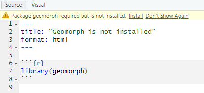

# Tables and Tibbles (and Tribbles){#tables}

```{r include=FALSE}
Sys.setenv(lang = "en_US")
library(tidyverse)
```

Please download the [exercise notebook](notebooks/Seminar 03 - Tables.qmd) (**Alt+Click** to download it or right-click as _Save link as..._), put it into your seminar project folder and open the project. You need both the text and the notebook with exercises to be open, as you will be switching between them.

## Primary data types {#primary-types}
Last time we talked about the fact that everything^[Terms and conditions apply.] is a vector in R. All examples in that chapter used numeric vectors which are two of the four primary types in R.

* `numeric`: Real numbers (_double precision floating point numbers_ to be more precise) that can be written in decimal notation with or without a decimal point (`123.4` or `42`) or in a scientific notation (`3.14e10`). There are two special values specific to the real numbers: `Inf` ([infinity](https://stat.ethz.ch/R-manual/R-devel/library/base/html/is.finite.html), which you will get if you divide a non-zero number by zero) and `NaN` ([not a number](https://stat.ethz.ch/R-manual/R-devel/library/base/html/is.finite.html)). The latter looks similar to `NA` ([Not Available / Missing Value](https://stat.ethz.ch/R-manual/R-devel/library/base/html/NA.html)) but is a different special case and are generated when you are trying to perform a mathematically undefined operation like diving by zero by zero or computing sine of infinity (see [R documentation](https://stat.ethz.ch/R-manual/R-devel/library/base/html/is.finite.html) for details).
* `integer`: Integer numbers that can be specified by adding `L` to the end of an integer number `5L`. Without that `L` a _real_ value will be created (`5` would be stored as `5.0`).
* `logical`: Logical or Boolean values of `TRUE` and `FALSE`. They can also be written as `T` and `F`  but this practice is discouraged by the [Tidyverse style guide](https://style.tidyverse.org/syntax.html?q=TRUE#logical-vectors).
* `character`: Character values (strings) that hold text between a pair of matching `"` or `'` characters. The two options mean that you can surround your text by `'` if you need to put a quote inside: `'"I have never let my schooling interfere with my education." Mark Twain'` or by `"` if you need an apostrophe `"participant's response"`. Note that a string **is not** a vector of characters. This would make a lot of sense but it is not. This is why [indexing](#vector-index) or [slicing](#vector-index-slicing) will not work and you need to use special functions that we will cover in a [later chapter](#strings).

You can convert from one type to another and check whether a particular vector is of specific type. Note that if a vector cannot be converted to a specified type, it is "converted" to `NA` instead.

* Convert to integer via [as.integer()](https://stat.ethz.ch/R-manual/R-devel/library/base/html/integer.html), use [is.integer()](https://stat.ethz.ch/R-manual/R-devel/library/base/html/integer.html) to check whether vector consist only of integers. When converting
    * from a real number the fractional part is _discarded_, so `as.integer(1.8)` → `1` and `as.integer(-2.1)` → `2`
    * from logical value `as.integer(TRUE)` → 1 and `as.integer(FALSE)` → 0
    * from string only if it is a properly formed number, e.g., `as.integer("12")` → `12` but `as.integer("_12_")` is `NA`. Note that a real number string is converted first to a real number and then to an integer so `as.integer("12.8")` → `12`.
    * from `NA` → `NA`

* Convert to real number via [as.numeric()](https://stat.ethz.ch/R-manual/R-devel/library/base/html/numeric.html) / [as.double()](https://stat.ethz.ch/R-manual/R-devel/library/base/html/double.html), check a  value  via [is.double()](https://stat.ethz.ch/R-manual/R-devel/library/base/html/double.html) (avoid [is.numeric()](https://stat.ethz.ch/R-manual/R-devel/library/base/html/numeric.html) as Hadley Wickham [writes](https://adv-r.hadley.nz/vectors-chap.html) that it is not doing what you would think it should).
    * from logical value `as.double(TRUE)` → 1.0 and `as.double(FALSE)` → 0.0
    * from string only it is a properly formed number, e.g. `as.double("12.2")` → `12.2` but `as.double("12punkt5")` is `NA`
    * from `NA` → `NA`

* Convert to logical `TRUE`/`FALSE` via [as.logical](https://stat.ethz.ch/R-manual/R-devel/library/base/html/logical.html) and check a value via [is.logical()](https://stat.ethz.ch/R-manual/R-devel/library/base/html/logical.html).
    * from integer or real, zero (`0` or `0.0`) is `FALSE`, any other non-zero value is `TRUE`
    * from a string, it is `TRUE` for `"TRUE"`, "`True"`, `"true"`, or `"T"` but `NA` if `"t"` `"TRue"`, `"truE`, etc. Same goes for `FALSE`.
    * from `NA` → `NA`

* Convert to a character string via [as.character()]((https://stat.ethz.ch/R-manual/R-devel/library/base/html/character.html)) and check via [is.character()]((https://stat.ethz.ch/R-manual/R-devel/library/base/html/character.html))^[Be aware that [str()](https://stat.ethz.ch/R-manual/R-devel/library/utils/html/str.html) function has nothing to do with strings but displays a structure of an object. A very unfortunate choice of name but we are stuck with it.]
    * numeric values are converted to a string representation with scientific notation being used for large numbers.
    * logical `TRUE`/`T` and `FALSE`/`T` are converted to `"TRUE"` and `"FALSE"`.
    * `NA` → `NA`

::: {.practice}
Do exercise 1.
:::

## All vector values must be of the same type {#vectors-are-homogeneous}
_All_ values in a vector must be of the same type --- all integer, all double, all logical, or all strings, which is why they are also called _atomic_ vectors. This ensures that you can apply the same function or operation to the entire vector without worrying about type compatibility. However, this means that you cannot mix different value types in a vector. If you do try to concatenate vectors of different types, all values will be converted to a more general / flexible type. Thus, if you mix numbers and logical values, you will end up with a vector of numbers. Mixing anything with strings will convert the entire vector to string. Mixing in `NA` does not change the vector type.

::: {.practice}
Do exercise 2.
:::

## Lists {#lists}
(Atomic) vectors are [homogeneous](#vectors-are-homogeneous) lists of [primary types](#primary-types) items, whereas [lists](https://stat.ethz.ch/R-manual/R-devel/library/base/html/list.html) are lists that can contain _any_ item including vectors of different primary type data, other lists, or other objects^[If you are familiar with Python, you can think of R lists as Python lists and dictionaries mixed together.].  Otherwise, you work with them _almost_ the same way as with vectors. You create a [list](https://stat.ethz.ch/R-manual/R-devel/library/base/html/list.html) via `list()` function and then you can concatenate lists via the same [c()]((https://stat.ethz.ch/R-manual/R-devel/library/base/html/c.html)) function, access individual elements via [numeric index](#vector-index) or [names](#names), use [slicing](#vector-index-slicing), etc. But...

## Subsetting, a fuller version {#subsetting}
Unfortunately, this is the point where we need to talk about subsetting (accessing individual elements of a vector or of a list via indexes or names) yet again. This is because R has several^[[Advanced R](https://adv-r.hadley.nz/subsetting.html#introduction-3) lists six(!) ways to subset atomic vectors, three(!) subsetting operators, and they can interact!] different ways of doing this that look similar and, to make things worse, _sometimes_ produce identical results. I do not expect you to memorize or even fully appreciate all the intricate details (I am not even sure I know them all). But I do need you to understand the fundamental difference between the two ways of doing subsetting and to be aware of potential issues that can easily cause confusion. If the latter is the case, return to this section, read the [official manual](https://stat.ethz.ch/R-manual/R-devel/library/base/html/Extract.html), or read the [subsetting](http://adv-r.had.co.nz/Subsetting.html) section in "Advanced R" book by Hadley Wickham.

You [already know](#vector-index) subsetting via _single_ square brackets: `x[1]`. This is called _preserving_ subsetting because it returns a _part of an object_ (vector or list) that your requested _as is_. I.e., if you used them to access part of a a vector, you get a vector. If you used them to access a list or a [table](#data.frame), you get a list or a table.

In addition, you can use _double_ square brackets: `x[[1]]`. These are called _simplifying_ subsetting because they extract _content_ at that location. If you have a list of vectors `l` then  `l[2]` (preserving) would return a single item list (with a vector as an item inside that list) but `l[[2]]` would return a vector stored at that location. A metaphor based on [\@RLangTip](https://twitter.com/rlangtip): "If list `x` is a train carrying objects, then `x[[5]]` is the object in car 5; `x[5]` is a train consisting only of car 5."

Note that the simplifying notation allows you to extract content of only _one_ item. Therefore, you cannot use it with [slicing](#vector-index-slicing) (extracting content of many items), negative indexes (even if you will end up with just one index), or zero index. The good news is that R will actually generate an error message instead of failing silently, although error messages will be both mysterious and _different_ depending on exact circumstances. To deepen your feeling of arbitrariness of R design: using a non-existent _name_ index will generate an error for vectors but not for lists (you get `NULL`)^[Insert a hair-pulling picture of your preference here.].

Confusing? Let us go through some examples, so you can see the difference these two kinds of brackets make for vectors and lists.

### Subsetting for (atomics) vectors
First, we create a named vector
```{r} 
x <- c("a"=1, "b"=2, "c"=3)
```

Preserving subsetting via `[]` returns a part of original vector, notice that the _name_ associated with an index is retained.
```{r}
x[2]
```

Simplifying subsetting via `[[]]` extracts value at the location. Because the _name_ is associated with an _index_, not with the content, it gets stripped off.
```{r}
x[[2]]
```

Trying to extract multiple items will fail for _simplifying_ subsetting.
```{r, error=TRUE, width=60}
x[[1:2]]
```

Same is true for negative indexes, even though we are excluding two out of three indexes, so end up with content from just one item.
```{r error=TRUE, width=60}
x[[-(1:2)]]
```

And the zero index generates an error as well but the error message is different.
```{r error=TRUE, width=60}
x[[0]]
```

Using of a non-existent name will generate an error for _simplifying_ but not for _preserving_ subsetting.
```{r}
x["a"]
```

This also works but strips the name off.
```{r}
x[["a"]]
```

This fails silently by returning `NA`.
```{r}
x["d"]
```

But this will generate an error.
```{r, error=TRUE}
x[["d"]]
```

**General rule:** when using vectors, always use `[]`. The only potential usage-case I can see is wanting to strip a name off a single item (not sure I ever needed to do this). If, for some reason, this is what you need, you should write a comment explaining that. Otherwise, everyone including future-you will be confused and think that this is a typo.

### Subsetting for lists{#list-subsetting}
First, we create a named list that includes another list as one of the items
```{r} 
l <- list("a"=1, "b"=2, "c"=list(3, 4, 5))
```

Preserving subsetting via `[]` returns a _list_ that is a part of original list, again the _name_ associated with an index, so it is retained in the returned list.
```{r}
l[2]
```

Simplifying subsetting via `[[]]` extracts value at the location. This is why you get a _vector_ (of length 1).
```{r}
l[[2]]
```

What about our list inside of the list at position 3? Using preserving subsetting give us a list inside of the list (car of the train). Again, note that the top level list retains the name.
```{r}
l["c"]
```

Using simplifying subsetting return a list that was inside the list at that location (object inside that car). Note that, as with the vector before, the name gets stripped off, as it belongs to the index (car of the train) and not the content (object inside the car).
```{r}
l[["c"]]
```

Again, using multiple indexes will fail.
```{r, error=TRUE}
l[[1:2]]
```

Same for negative indexe.
```{r error=TRUE}
l[[-(1:2)]]
```

And for the zero index (but notice a _different_ error message).
```{r error=TRUE}
l[[0]]
```

Using a non-existent name index for lists with preserving subsetting (`[]`) will return a single item list with `NULL` as a content^[And `NA` as a name. Don't ask.] but just `NULL` for simplifying one (`[[]]`). And none of them will generate an error.
```{r}
l["d"]

l[["d"]]
```

**General rule:** use `[[]]` if you are interested in list or table content, e.g., you need a column from the table. Use `[]` if you interested in using a smaller (part of the original) list or table.

If this is the point when you want to start running around screaming or bang your head against the screen, please tell me, cause I would definitely join you. Let us do some exercises that might help to build some intuition. However, as you probably noticed already, subsetting in R is fairly haphazard, so you probably will still end up being confused or have a code that does not work for seemingly mysterious reasons.

::: {.practice}
Do exercise 3.
:::


## Yet another subsetting via \$ {#dollar-subsetting}
I am terribly sorry but I need to deepen your confusion and despair but telling you that R has yet _another_ way of subsetting via a `$` sign. In fact, this is the most common way of subsetting for lists and [tables](#data.frame) that you will encounter almost everywhere. It is a shortcut version for _partial matching_ of simplifying subsetting: `l$c` is the same as writing  `l[["c", exact = FALSE]]`. The last new part `exact = FALSE` means that you can use an _incomplete_ name after the `$` and R will guess what you mean. So, if you made a typo while meaning some completely different column name, R will second-guess your intentions and give you a variable that has the same beginning (no error, don't even hope).
```{r}
l <- list("aa" = 1, "bb" = 2, "bc" = 3)
l$a
```

The good news is that it won't autocomplete ambiguous cases. The bad news that it won't generate an error and will return a `NULL` (just like `[[]]` would).
```{r}
l$b
l[['b']]
```

My advice would be to stick to `[[]]` notation despite the ubiquitous use of `$` out where. `[[]]` is slightly more strict and more universal: You can hard code a column/item name or put it into a variable for indexing. Only hard-coding works for `$`.

```{r}
l[["bb"]]

column_of_interest <- "bb"
l[[column_of_interest]]
```

## Tables, a.k.a. data frames {#data.frame}
R tables are a mix between [lists](https://stat.ethz.ch/R-manual/R-devel/library/base/html/list.html) and [matrices](https://stat.ethz.ch/R-manual/R-devel/library/base/html/matrix.html). You can think about it as a list of vectors (columns) of _identical_ length. The default way to construct a table, which are called _data frames_ in R, is via [data.frame()](https://www.rdocumentation.org/packages/base/versions/3.6.2/topics/data.frame) function.
```{r}
our_first_table <- data.frame(numeric_column = c(1, 2, 3, 4), 
                              character_column = c("A", "B", "C", "D"),
                              logical_column = c(TRUE, F, T, FALSE))

our_first_table
```

Once you create a table, it will appear in your environment, so you can see it in the _Environment_ tab and view it by clicking on it or typing `View(table_name)` in the console (note the capital V in the `View()`).
```{r echo=FALSE, out.width = "100%", fig.align = 'center'}
knitr::include_graphics("images/viewing-table.png")
```

::: {.practice}
Do exercise 4.
:::


All columns in a table **must** have the same number of items (rows). If the vectors are of different length, R will match their length via recycling of shorter vectors. This is similar to the process of [matching vectors' length](#different-length-vectors) that you have learned the last time. However, it works automatically only if length of _all_ vectors is a multiple of the longest length. Thus, the example below will work, as the longest vector (`numeric_column`) is 6, `character_column` length is 3, so it will be repeated twice, and `logical_column` length is 2 so it will be repeated thrice. 
```{r}
the_table <- data.frame(numeric_column = 1:6,                  # length 6 
                        character_column = c("A", "B", "C"),   # length 3
                        logical_column = c(TRUE, FALSE))       # length 2
the_table
```

If the simple _multple-of-length_ rule does not work, R generates an error (finally!).
```{r error=TRUE, width=60}
# this will generate an error: arguments imply differing number of rows
the_table <- data.frame(numeric_column = 1:7,                 # length 7
                        character_column = c("A", "B", "C"))  # length 3, cannot be multiplied by an integer to get 7
```

::: {.practice}
Do exercise 5.
:::


## Subsetting tables {#table-subsetting}
One way to think about a table as a list of columns (vectors). Hence, both preserving (`[]`) and simplifying (`[[]]`) subsetting will work as you would expect returning either a `data.frame` (`[]`) or a _vector_ that was a column your were interested in (`[[]]`).

The preserving returns a _table_ with _one_ column.
```{r}
our_first_table <- data.frame(numeric_column = c(1, 2, 3), 
                              character_column = c("A", "B", "C"),
                              logical_column = c(TRUE, F, T))

# via index
our_first_table[1]

# via name 
our_first_table['numeric_column']

# via slicing
our_first_table[1:2]
```

```{r echo=FALSE, out.width = "100%", fig.align = 'center'}
knitr::include_graphics("images/table-subtable.png")
```


The simplifying returns a _vector_.
```{r}
# via $ notation
our_first_table$numeric_column

# via name and double square brackets
our_first_table[['numeric_column']]

# via index and double square brackets
our_first_table[[1]]
```


```{r echo=FALSE, out.width = "100%", fig.align = 'center'}
knitr::include_graphics("images/table-column.png")
```

The only new thing is that, because tables are two-dimensionsional, you can use preserving subsetting to extract or access a rectangular region within a table. To select a subset rows and columns you write `table[rows, columns]`. If you omit either rows or columns this implies that you want _all_ rows or columns.

```{r}
# getting ALL rows for the FIRST column -> confusingly this gives you a VECTOR, 
# so even though you used [] they work as simplifying subsetting
our_first_table[, 1]

# getting FIRST row for ALL columns -> this gives you DATA.FRAME
our_first_table[1, ]

# ALL rows and ALL columns, equivalent to just writing `our_first_table` or `our_first_table[]`
# this gives you DATA.FRAME
our_first_table[,]

# getting SECOND element of the THIRD column, returns a VECTOR
our_first_table[2, 3]

# getting first two elements of the logical_column, returns a VECTOR
our_first_table[1:2, "logical_column"]
```

```{r echo=FALSE, out.width = "100%", fig.align = 'center'}
knitr::include_graphics("images/table-rows-columns.png")
```

::: {.practice}
Do exercise 6.
:::

## Using libraries {#library}
There is a better way to construct a table but to use it, we need to first import a library that implements it. As with most modern programming languages, the real power of R is not in what comes bundled with it (very little, as a matter of fact) but in community developed libraries that extend it. We already discussed how you [install libraries](#install.packages).To use a library in your code, you use [library()](https://www.rdocumentation.org/packages/base/versions/3.6.2/topics/library) function^[It has a sister function `require()` but it should be used inside functions and packages not in scripts or notebooks]. So, to use _tidyverse_ library that you already installed, you simply write
```{r eval=FALSE}
library(tidyverse)
# or
library("tidyverse")
```

One thing to keep in mind is that if you import two libraries that have a function with same name, the function from the _latter_ package will overwrite (mask) the function from the former. You will get a warning but if you miss it, it may be very confusing. My favorite stumbling block are functions `filter()` from `dplyr` package (we will use it extensively, as it filters a table by row) and `filter()` function from `signal` package (applies a filter to a time-series)^[There is also a filter function is stats library.]. This overwriting of one function by another can lead to very odd looking mistakes. In my case I think that I am using `dplyr::filter()` and get confused by error messages that I get (they are not really informative). The first time I did this, it took me an hour to figure it out. Here are the warnings I should have paid attention to.
```r
library(signal)


Attaching package: ‘signal’

The following object is masked from ‘package:dplyr’:

    filter

The following objects are masked from ‘package:stats’:

    filter, poly
```


Thus, keep that in mind or, better still, explicitly mention which package the function is coming from via `library::function()` notation. In this case, you will use the function that you are interested in and need not to worry about other functions with the same name that may conflict with it. In general, it is a good idea to _always_ disambiguate function via library but in practice it may make your code hard to read by cluttering it with `library::` prefixes. Thus, you will need to find a balance between disambiguation and readability.
```{r}
library(tibble)

# imported from the library into the global environment
print(tribble(~a, 1))

# used directly from the package
tibble::tribble(~a, 1)
```

When using a notebook (so, in our case, always) put the libraries into the first chunk of the notebook. In case of Quatro and Rmarkdown notebooks, if you call this chunk "setup", RStudio will run it at least ones before any other chunk, ensuring that your libraries are always initialized (take a look at the very first chunk in the exercise notebook). Word of advice, keep you library list in alphabetical order. Libraries are very specialized, so you will need quite a few of them for a typical analysis. Keeping them alphabetically organized makes it easier to see whether you imported the required library and whether you need to install a new one. 

Another note, sometimes you may need to install packages and it might be tempting to include `install.packages("library-I-needed")` into the notebook or R script. Do not do this, as it will run installation every time you or somebody else run that chunk/script or knit the notebook, which could waste time, lead to errors (if you are offline), mess up other packages, etc. RStudio is smart enough to detect missing packages and will display an alert about this, offering to install it.
```{r echo=FALSE, out.width = "100%", fig.align = 'center'}

```


## Tibble, a better data.frame {#tibble}
Although the `data.frame()` function is the default way of creating a table, it is a legacy implementation with numerous shortcomings. Tidyverse implemented its own version of the table called [tibble()](https://tibble.tidyverse.org/) that provides a more rigorous control and more consistent behavior. For example, it allows you to use any symbol in columns names (including spaces), prints out only the beginning of the table rather than entire table, etc. It also gives more warnings. If you try to access a non-existing column both `data.frame()` and `tibble()` will return `NULL` but the former will do it silently, whereas the latter will give you a warning but only if you use the `$` notation^[Arbitrariness strikes again! But this also means that `$` is safer to use with tibbles but not with data.frames.].

```{r}
library(tibble)

# data.frame will return NULL silently
df <- data.frame(b = 1)
print(df[["A"]])

# tibble will return NULL for a variable that does not exist for [[]]
tbl <- tibble(b = 1)
print(tbl[["A"]])

# but a warning here
tbl$A
```
In short, `tibble()` provides a more robust version of a `data.frame` but otherwise behaves (mostly) identically to it. Thus, it should be your default choice for a table.

## Tribble, table from text {#tribble}
The tibble package also provides an easier way of constructing tables via the [tribble()](https://tibble.tidyverse.org/reference/tribble.html) function. Here, you use tilde to specify column names, and then write its content row-by-row.
```{r }
tribble(
    ~x, ~y,
    1,  "a",
    2,  "b"
)
```

::: {.practice}
Do exercise 7.
:::

## Reading example tables {#data}
One of the great things about R is that most packages come with an example data set that illustrates their function. You can see the list of some of them [here](https://www.rdocumentation.org/packages/datasets). In case of an example data set, you need to import the library that it is part of and then load them by writing `data(tablename)`. For example, to use use `mpg` data on fuel economy from `ggplot2` package, you need to import the library first, and then call `data(mpg)`.

```{r}
library(ggplot2)
data(mpg) # this creates a "promise" of the data
print(mpg) # any action on the promise leads to data appearing in the environment
```

## Reading csv files {#readr}
So far we covered creating a table by hand via `data.frame()`, `tibble()`, or `tribble()` functions and loading an example table from a package via `data()` function. More commonly, you will need to read a table from an external file. These files can come in many formats because they are generated by different experimental software. Below, you will see how to handle those but my recommendation is to always store your data in a csv ([Comma-separated values](https://en.wikipedia.org/wiki/Comma-separated_values)) files. These are simple plain text files, which means you can open them in any text editor, with each line representing a single row (typically, top row contains column names) with individual columns separated by some symbol or symbols. Typical separators are a comma (hence, the name), a semicolon (this is frequently used in Germany, with comma serving as a decimal point), a tabulator, or even a space symbol. Here is an example of such file
```
Participant,Block,Trial,Contrast,Correct
A1,1,1,0.5,TRUE
A1,1,2,1.0,TRUE
A1,1,2,0.05,FALSE
...
```
that is turned into a table when loaded
```{r echo=FALSE, out.width = "70%", fig.align = 'center'}
knitr::include_graphics("images/results-csv-table.png")
```

There are several ways of reading CSV files in R. The default way is [read.csv()](https://stat.ethz.ch/R-manual/R-devel/library/utils/html/read.table.html) function that has different versions optimized for different combinations of the decimal point and separator symbols, e.g. `read.csv2()` assumes a comma for the decimal point and semicolon as a separator. However, a better way is to use [readr](https://readr.tidyverse.org/) library that re-implements same functions. Names of the functions are slightly different with underscore replacing the dot, so `readr::read_csv()` is a replacement for `read.csv()`. These are faster (although it will be noticeable only on large data sets), do not convert text to factor variables (we will talk about factors later but this default conversion by `read.csv()` can be very confusing), etc.

However, the most important difference between `read.csv()` and `read_csv()` is that the latter can constrain the content of a CSV file. `read.csv()` has not assumptions about which columns are in the file and what their value types are. It simply reads them as is, _silently_ guessing their type.
```{r}
results <- read.csv("data/example.csv")
results
```

You can use `read_csv()` the same way and it will work the same way but will inform (warn) you about the table structure it deduced.
```{r}
results <- readr::read_csv("data/example.csv")
results
```

This annoying warning, which gets even more annoying if you need to read many CSV files, is there for a reason: it wants to annoy you! You can turn it off via `show_col_types = FALSE` but I strongly recommend against this. Instead, you should specify the column structure yourself via `col_types` parameter. The simplest way to do this is via  [spec()](https://readr.tidyverse.org/reference/spec.html) function, as suggested by the printout.
```{r}
spec(results)
```
This is a specification that the reader prepared for you. So you can take a look at it, adjust it, if necessary, and copy-paste to the `read_csv` call. By default, it suggested `double` values for `Block` and `Trial` but we know they are integers, so we can copy-paste the suggested structure, replace `col_double()` with `col_integer()` and read the table without a warning.
```{r}
library(readr)
results <- read_csv("data/example.csv", 
                    col_types = cols(Participant = col_character(),
                                     Block = col_integer(), # read_csv suggested col_double() but we know better
                                     Trial = col_integer(), # read_csv suggested col_double() but we know better
                                     Contrast = col_double(),
                                     Correct = col_logical()))
results
```

You may feel that this a lot of extra work just to suppress an annoying but, ultimately, harmless warning. Your code will work with or without it, right? Well, _hopefully_ it will but you probably want to _know_ that it will work not just _hope_ for it. Imagine that you accidentally overwrote your experimental data file with data from a different experiment (that happens more often than one would want). You still have `results.csv` file in your project folder and so the `read.csv()` and `read_csv()` both will read it as is (it does not know what should be in that file) and your analysis code will fail in some mysterious ways at a much later point (because, remember, if you try to access a column/variable that does not exist in the table, you just get `NULL` rather than an error). You will eventually trace it back to the wrong data file but that will cost time and nerves. However, if you specify the column structure in `read_csv()` it will show a warning, if the file does not match the description. It would warn about wrong column names (`TheBlock` in the example below) and about wrong type (it does not like `TRUE`/`FALSE` in a column it expected to find integers in, you can see the details via [problems()](https://vroom.r-lib.org/reference/problems.html) function).

```{r}
results <- read_csv("data/example.csv", 
                    col_types = cols(Participant = col_character(),
                                     TheBlock = col_integer(), # read_csv suggested col_double() but we know better
                                     Trial = col_integer(), # read_csv suggested col_double() but we know better
                                     Contrast = col_double(),
                                     Correct = col_integer()))
problems()
```

Personally, I would prefer for `read_csv()` to loudly fail with an error in cases like these but having a nice red warning is already very helpful to quickly detect the problem with your data (and if your data is wrong, your whole analysis is meaningless). Thus, _always_ use `read_` rather than `read.` functions and _always_ specify the table structure. The lazy, and my preferred, way to do it, is to first read the file without specifying the structure, run [spec()](https://readr.tidyverse.org/reference/spec.html) function on it, and copy-paste the output into the code adjusting as necessary.

You will need [face_rank.csv](data/face_rank.csv) file for exercise 8. Download it and place it in the project folder. _Warning_, if you use Chrome or any Chromium-based browsers like MS Edge, Opera,  etc. they might, for some odd reason, automatically *rename it* into _face_rank.xls_ during the download (it does not happen as I write this, but it was an issue at some point of time). Just rename it back to _face_rank.csv_, because the file itself is not converted to an Excel, it is only the extension that gets changed^[why? No idea, ask Google!].

::: {.practice}
Do exercise 8.
:::

Note that you have another option with online files, you can use their URL in-place of the filename and R will take care of downloading it for you (but, obviously, you have to be online for this trick to work).
```r
read_csv("https://alexander-pastukhov.github.io/data-analysis-using-r-for-psychology/data/face_rank.csv")
```

## Reading Excel files {#readxl}
There are several libraries that allow you to read Excel files directly. My personal preference is [readxl](https://readxl.tidyverse.org/) package, which is part of the Tidyverse. Warning, it will be installed as part of the Tidyverse (i.e., when you typed `install.packages(tidyverse)`) but you still need to import it explicitly via `library(readxl)`. Because an Excel file has many sheets, by default the `read_excel()` function reads the _first_ sheet but you can specify it via a `sheet` parameter using its index `read_excel("my_excel_file.xls", sheet=2)` or name `read_excel("my_excel_file.xls", sheet="addendum")`.

For the exercise 9, you need [face_rank.xlsx](data/face_rank.xlsx) file for it. Download it or use the URL directly. Also, think about which library you need to do to perform the task. Add this library to the "setup" chunk at the beginning, not to the exercise chunk itself!

::: {.practice}
Do exercise 9.
:::

You can read about further options at the package's website but I would generally discourage you from using Excel for your work and, definitely, for your data analysis. Because, you see, Excel is very smart and it can figure out the _true_ meaning and type of columns by itself. The fact that you might disagree is your problem. Excel knows what is best for you. The easiest way to screw a CSV file up (at least in Germany) is to open it in Excel and immediately save it. The file name will remain the same but Excel will "adjust" the content as it feels is better for you (you don't need to be consulted with). If you think I am exaggerating, read this [article](https://www.theverge.com/2020/8/6/21355674/human-genes-rename-microsoft-excel-misreading-dates) at The Verge on how Excel messed up thousands of human genome data tables by turning some values into dates because why not^[Best joke on that that I've heard so far is: Optimist thinks that the glass is half full, pessimist thinks it is half empty, Excel thinks is it second of February.]? So now the entire community is _renaming_ some genes because it is easier to waste literally thousands of man-hours on that than to fix Excel. In short, friends don't let friends use Excel.

## Reading files from other programs
World is a very diverse place, so you are likely to encounter a wide range of data files generated by Matlab, SPSS, SAS, etc. There are two ways to import the data. First, that I would recommend, use the original program (Matlab, SPSS, SAS, etc.) to export data as a CSV file. Every program can read and write CSV, so it a good common ground. Moreover, this is a simple format with no embedded formulas (as in Excel), service structures, etc. Finally, if you store your data in CSV, you do not need a special program to work with it. In short, unless you have a good reason, store your data in CSV files.

However, sometimes you have a file but you do not have the program (Matlab, SPSS, SAS, etc.) to export data into a CSV. The second way is to use various R libaries, starting with [foreign](https://www.rdocumentation.org/packages/foreign), which can handle most typical cases, e.g., SPSS, SAS, State, or Minitab. The problem here is that all programs differ in the internal file formats and what exactly is included. For example, when importing from an SPSS sav-file via [read.spss](https://www.rdocumentation.org/packages/foreign/versions/0.8-80/topics/read.spss) you will get a list with various components rather than a table (`data.frame`). You can force the function to convert everything to a single table via `to.data.frame=TRUE` option but you may lose some information. Bottom line, you need to be extra careful when importing from other formats and the safest way is to ensure complete and full export of the data to a CSV from the original program.

For the next exercise, you need [band_members.sav](data/band_members.sav) file. You need `read.spss()` function from library `foreign` (again, if you need to import it, do it in the "setup" chunk). 

::: {.practice}
Do exercise 10.
:::

## Writing and reading a single object {#rds}
There is another option for saving and reading data in R via [saveRDS()](https://stat.ethz.ch/R-manual/R-devel/library/base/html/readRDS.html) and [readRDS](https://stat.ethz.ch/R-manual/R-devel/library/base/html/readRDS.html) functions^[This is another example of odd inconsistencies in R. Why `readRDS()` instead of `loadRDS()`? Or `writeRDS()` if you read it.]. [saveRDS()](https://stat.ethz.ch/R-manual/R-devel/library/base/html/readRDS.html) saves an arbitrary object (vector, list, table, model fit, etc.), whereas [readRDS](https://stat.ethz.ch/R-manual/R-devel/library/base/html/readRDS.html) reads it back. This is useful, if your table is very large, so using CSV is inefficient, or if you want to save something that is not a table, again, something like a model fit for later use. This is an R-specific format, so you will not be able to use this file with other program, so you probably will not use this frequently but it is a good option to keep in mind.

::: {.practice}
Do exercise 11.
:::

## Wrap up
We have started with vectors and now extended them to tables. Our final stop, before getting into exciting visualizations, are functions, the other most important pillar of R.
