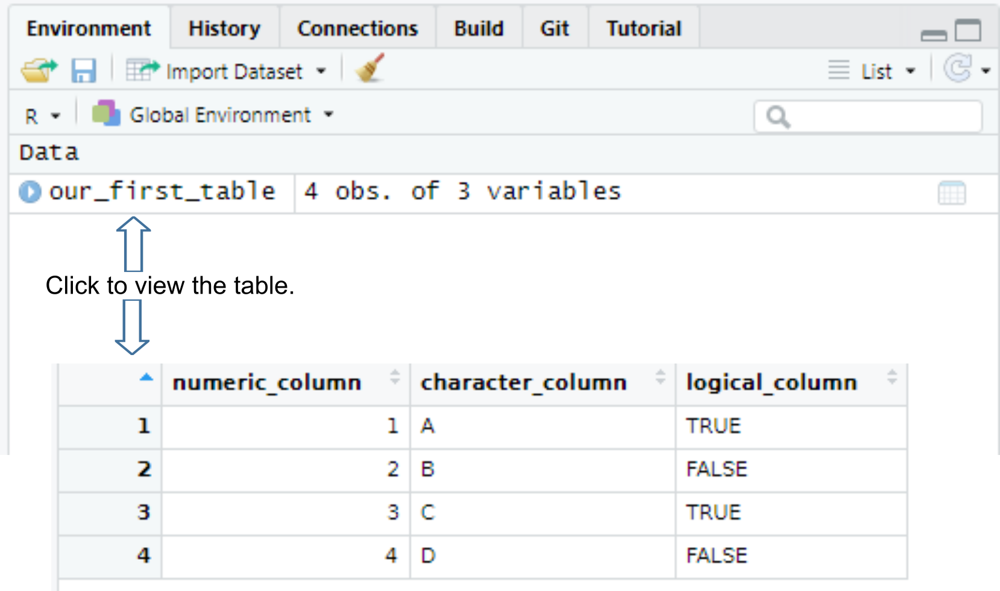
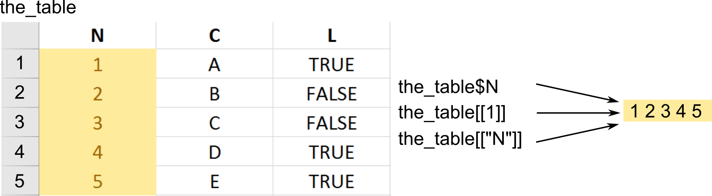
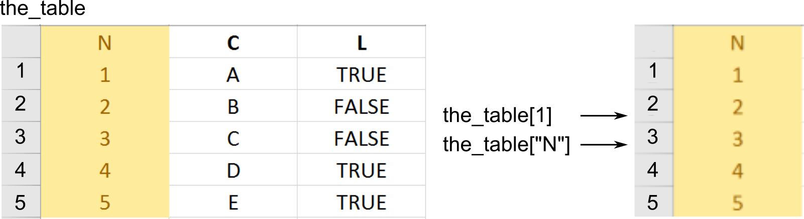
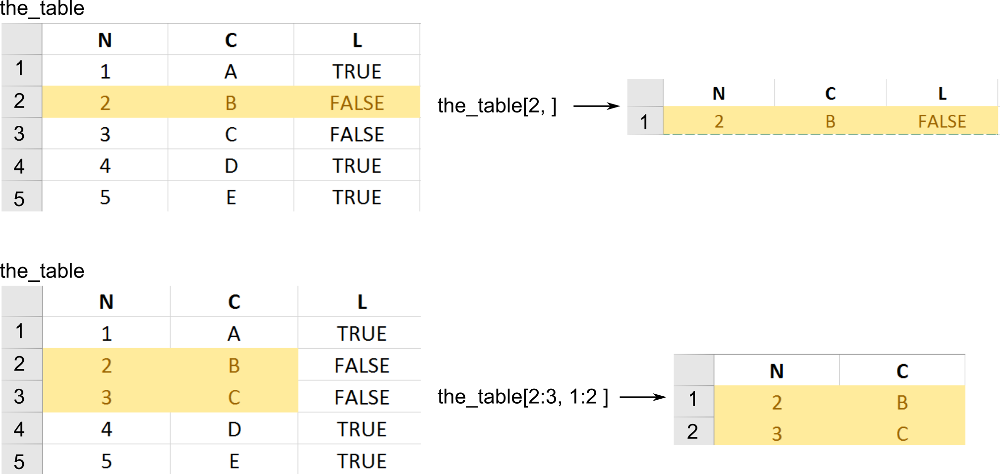
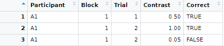

# Tables and Tibbles (and Tribbles){#tables}

Please download the [exercise notebook](notebooks/Seminar 03 - Tables.Rmd) (`Alt + Click` to download it or right-click as `Save link as...`), put it into your seminar project folder and open the project. You need both the text and the notebook with exercises to be open, as you will be switching between them.

## Primary data types {#primarytypes}
Last time we talked about the fact that everything is a vector in R. All the examples used numeric vectors which are two of the four primary types in R. 

* Real numbers (double precision floating point numbers) that can be written in decimal notation with or without a decimal point (`123.4` or `42`) or in a scientific notation (`3.14e10`). There are two special values specific to the real numbers: `Inf` (infinity) and `NaN` (not a number). The latter looks similar  `NA` (Not Available / Missing Value) but is a different special case.
* Integer numbers that can be specified by adding `L` to the end of an integer number `5L`. Without that `L` a _real_ value will be created (`5` would be stored as `5.0`).
* Logical or Boolean values of `TRUE` (also written as `T`) and `FALSE` (also written as `F`).
* Character values (strings) that hold text between a pair of matching `"` or `'` characters. The two options mean that you can surround your text by `'` if you need to put a quote inside: `'"I have never let my schooling interfere with my education." Mark Twain'` or by `"` if you need an apostrophe `"participant's response"`.

You can convert from one type to another and check whether a particular vector is of specific type. Note that if a vector cannot be converted to a specified type, it is "converted" to `NA` instead.

* to integer via `as.integer()`  and `is.integer`. When converting
    * from a real number the fractional part is discarded, so `as.integer(1.8)` → `1` and `as.integer(-2.1)` → `2`
    * from logical value `as.integer(TRUE)` → 1 and `as.integer(FALSE)` → 0
    * from string only it is a properly formed number, e.g. `as.integer("12")` → `12` but `as.integer("_12_")` is `NA`. Note that a real number string is converted first to a real number and then to an integer so `as.integer("12.8")` → `12`.
    * from `NA` → `NA`
* to real number via `as.numeric()` / `as.double()` and `is.double()` (avoid `is.numeric()` as Hadley Wickham [writes](https://adv-r.hadley.nz/vectors-chap.html) that it is not doing what you would think it should).
    * from logical value `as.double(TRUE)` → 1.0 and `as.double(FALSE)` → 0.0
    * from string only it is a properly formed number, e.g. `as.double("12.2")` → `12.2` but `as.double("12punkt5")` is `NA`
    * from `NA` → `NA`
* to logical `TRUE`/`FALSE` via `as.logical` and `is.logical()`.
    * from integer or real, zero (`0` or `0.0`) is `FALSE`, any other non-zero value is `TRUE`
    * from a string, it is `TRUE` for `"TRUE"`, "`True"`, `"true"`, or `"T"` but `NA` if `"t"` `"TRue"`, `"truE`, etc. Same goes for `FALSE`.
    * from `NA` → `NA`

* to a character string via `as.character()` and `is.character()`
    * numeric values are converted to a string representation with scientific notation being used for large numbers.
    * logical `TRUE`/`T` and `FALSE`/`T` are converted to `"TRUE"` and `"FALSE"`.
    * `NA` → `NA`

::: {.infobox .practice}
Do exercise 1.
:::

## In vector all values must be of the same type
**All** values in a vector must be of the same type - all integer, all double, all logical, or all strings. This ensures that you can apply the same function or operation to the entire vector without worrying about type compatibility. This means, however, that you cannot mix different value types in a vector. If you do try to concatenate vectors of different types, all values will be converted to a more general / flexible type. Thus, if you mix numbers and logical values, you will end up with a vector of numbers. Mixing anything with strings will convert the entire vector to string. Mixing in `NA` does not change the vector type.

::: {.infobox .practice}
Do exercise 2.
:::

## Tables, a.k.a. data frames {#data.frame}
We have spent so much time on vectors because a data table is merely a vector (well, technically, a [list](https://www.rdocumentation.org/packages/base/versions/3.6.2/topics/list)) of vectors, with each vector as a column. The default way to construct a table, which are called _data frames_ in R, is via [data.frame()](https://www.rdocumentation.org/packages/base/versions/3.6.2/topics/data.frame) function.
```{r}
our_first_table <- data.frame(numeric_column = c(1, 2, 3, 4), 
                              character_column = c("A", "B", "C", "D"),
                              logical_column = c(TRUE, F, T, FALSE))

our_first_table
```

Once you create a table, it will appear in your environment, so you can see it in the _Environment_ tab and view it by clicking on it or typing `View(table_name)` in the console (not the capital V in the `View()`).

```{r echo=FALSE, out.width = "100%", fig.align = 'center'}

```

::: {.infobox .practice}
Do exercise 3.
:::


Because all columns in a table **must** have the same number of rows. This is similar to the process of [matching vectors' length](#different-length-vectors) that you have learned the last time. However, it works automatically only if length of _all_ vectors is a multiple of the longest length. Thus, the example below will work, as the longest vector (`numeric_column`) is 6, `character_column` length is 3, so it will be repeated twice, and `logical_column` length is 2 so it will be repeated thrice. 
```{r}
the_table <- data.frame(numeric_column = 1:6,                  # length 6 
                        character_column = c("A", "B", "C"),   # length 3
                        logical_column = c(TRUE, FALSE))       # length 2
the_table
```

If the simple _multple-of-length_ rule does not work, R (finally!) generates an error.
```{r eval=FALSE}
# this will generate an error: arguments imply differing number of rows
the_table <- data.frame(numeric_column = 1:7,                 # length 7
                        character_column = c("A", "B", "C"))  # length 3, cannot be multiplied by an integer to get 7
```

::: {.infobox .practice}
Do exercise 4.
:::


Just as with the vectors, you can extract or modify only some elements (rows, columns, subsets) of a table. There are several ways to do it, as you can extract individual elements, individual columns, individual rows, or some rows and some columns. Subsetting tables is not the most exciting and fairly confusing topic but you need to understand it as in the R code that you will encounter different notations could be used interchangeably.

## Extracting a single vector / column

To access individual _vectors_ (a.k.a. columns  or variables) use dollar notation `table$column_name` (this should be your default way) or **double** square brackets, `table[[column_name]]` or `table[[column_index]]`. Note that you cannot use multiple indexes (`c(1, 2)`) or slicing (e.g., `1:2`) with double square brackets. The important if subtle detail is that this notation returns a _vector_, just a like one that you create via `c()` function.
```{r}
our_first_table <- data.frame(numeric_column = c(1, 2, 3), 
                              character_column = c("A", "B", "C"),
                              logical_column = c(TRUE, F, T))

# via $ notation
our_first_table$numeric_column

# via name and double square brackets
our_first_table[['numeric_column']]

# via index and double square brackets
our_first_table[[1]]
```


```{r echo=FALSE, out.width = "100%", fig.align = 'center'}

```

## Extracting part of a table {#table-indexing}
Alternatively, you can extract or access a rectangular part of the table via **single** square brackets. To get one or more columns you can use their names or indexes just as you did with vectors.

```{r}
our_first_table <- data.frame(numeric_column = c(1, 2, 3), 
                              character_column = c("A", "B", "C"),
                              logical_column = c(TRUE, F, T))

# via index
our_first_table[1]

# via name 
our_first_table['numeric_column']

# via slicing
our_first_table[1:2]
```

```{r echo=FALSE, out.width = "100%", fig.align = 'center'}

```


Again, note that first two call get you a single-column table not a vector. You still need to use  the column name to access its values.

```{r}
our_first_table <- data.frame(numeric_column = c(1, 2, 3), 
                              character_column = c("A", "B", "C"),
                              logical_column = c(TRUE, F, T))

table_copy <- our_first_table[1]
table_copy$numeric_column
```

To select a subset rows and columns you write `table[rows, column]`. If you omit either rows or columns this implies that you want _all_ rows or columns.
```{r}
our_first_table <- data.frame(numeric_column = c(1, 2, 3), 
                              character_column = c("A", "B", "C"),
                              logical_column = c(TRUE, F, T))

# getting ALL rows for the FIRST column -> this gives you a VECTOR
our_first_table[, 1]

# getting FIRST row for ALL columns -> this gives you DATA.FRAME
our_first_table[1, ]

# ALL rows and ALL columns, equivalent to just writing `our_first_table` or `our_first_table[]`
our_first_table[,]

# getting SECOND element of the THIRD column
our_first_table[2, 3]

# getting first two elements of the logical_column
our_first_table[1:2, "logical_column"]
```

```{r echo=FALSE, out.width = "100%", fig.align = 'center'}

```

::: {.infobox .practice}
Do exercise 5.
:::

## Using libraries {#library}
There is a better way to construct a table but to use it, we need to first import a library that implements it. As with most modern programming languages, the real power of R is not what comes bundled with it (very little, as a matter of fact) but community developed libraries that extend it. We already discussed how you [install libraries](#install.packages). For that you use [library()](https://www.rdocumentation.org/packages/base/versions/3.6.2/topics/library) function (it has a sister function `require()` but it should be used inside functions and packages not in scripts or notebooks). So, to use _tidyverse_ library that you already installed, you simply write
```{r eval=FALSE}
library(tidyverse)
# or
library("tidyverse")
```

One thing to keep in mind is that if you import two libraries that have a function with same name, the function from the _latter_ package will overwrite (mask) the function from the former. You will get a warning but if you miss it, it may be very confusing. My favorite stumbling block are functions `filter()` from `dplyr` package (we will use it extensively, as it filters a table by row) and `filter()` function from `signal` package (applies a filter to a time-series). This overwriting of one function by another can lead to very odd looking mistakes. In my case I though I was using `dplyr::filter()` and could not understand the error message I was getting, it it took me an hour to figure it out the first time. Here are the warnings I should have paid attention to.
```{r}
library(dplyr)
```
Thus, keep that in mind or, better still, explicitly mention which package the function is coming from via `library::function()` notation. In this case, you will use the function that you are interested in and need not to worry about other functions with the same name that may conflict with it. In general, it is a good idea to _always_ disambiguate function via library but in practice it may make your code hard to read by littering it with `library::` prefixes. Thus, you will need to find a balance between disambiguation and readability.
```{r}
library(tibble)

# imported from the library into the global environment
print(tribble(~a, 1))

# used directly from the package
tibble::tribble(~a, 1)
```

When using a notebook (so, in our case, always) put the libraries into _setup_ chunk of the notebook. This ensures that your libraries are always initialized, even if you first run some other chunk. Word of advice, keep you library list in alphabetical order. Because libraries are very specialized, you will need quite a few of them for a typical analysis. Keeping them alphabetically organized makes it easier to see whether you imported the required library and whether you need to install a new one.

## Tibble, a better data.frame {#tibble}
Although the `data.frame()` function is the default way of creating a table, it is a legacy implementation with numerous shortcomings. Tidyverse implemented its own version of the table called [tibble()](https://tibble.tidyverse.org/) that provides a more rigorous control and more consistent behavior. For example, it allows you to use any symbols for the columns names (including spaces), prints out only beginning of the table rather than entire table, etc. It also gives more warnings. If you try to access a non-existing column both `data.frame()` and `tibble()` will return `NULL` but the former will do it silently, whereas the latter will complain.

```{r}
library(tibble)

# data.frame will return NULL silently
df <- data.frame(b = 1)
print(df$A)

# data.frame will return NULL for a variable that does not exist

tbl <- tibble(b = 1)
print(tbl$A)
```
In short, `tibble()` provides a more robust version of a `data.frame` but otherwise behaves (mostly) identically to it. Thus, it should be your default choice for a table.

## Tribble, table from text {#tribble}
The tibble package also provides an easier to read way of constructing tables via the [tribble()](https://tibble.tidyverse.org/reference/tribble.html) function. Here, you use tilde to specify column names, and then write the content row-by-row.
```{r }
tribble(
    ~x, ~y,
    1,  "a",
    2,  "b"
)
```

::: {.infobox .practice}
Do exercise 6.
:::

## Reading example tables {#data}
One of the great things about R is that most packages come with an example data set that illustrates their function. You can see the list of some of them [here](https://www.rdocumentation.org/packages/datasets). In case of example data set, you need to import the library it is part of and then load them by writing `data(tablename)`. For example, to use use `mpg` data on fuel economy from `ggplot2` package, you need to import the library first, and then call `data(mpg)`.

```{r}
library(ggplot2)
data(mpg) # this create a "promise" of the data
print(mpg) # any action on the promise leads to data appearing in the environment
```
## Reading csv files {#readr}
So far we covered creating a table by hand via `data.frame()`, `tibble()`, or `tribble()` functions and loading an example table from a package via `data()` function. More commonly, you will need to read a table from an external file. These files can come in many formats because they are generated by different experimental software. Below, you will see how to handle those but my recommendation is to always store your data in a csv ([Comma-separated values](https://en.wikipedia.org/wiki/Comma-separated_values)) files. These are simple plain text files, which means you can open them in any text editor, with each line representing a single row (typically, top row contains column names) with individual columns separated by some symbol or symbols. Typical separators are a comma (hence, the name), a semicolon (this is frequently used in Germany, with comma serving as a decimal point), a tabulator, or even a space symbol. Here is an example of such file
```
Participant,Block,Trial,Contrast,Correct
A1,1,1,0.5,TRUE
A1,1,2,1.0,TRUE
A1,1,2,0.05,FALSE
...
```
that is turned into a table when loaded
```{r echo=FALSE, out.width = "70%", fig.align = 'center'}

```

There are several ways of reading CSV files in R. The default way by using [read.csv()](https://stat.ethz.ch/R-manual/R-devel/library/utils/html/read.table.html) function that comes has different versions optimized for different combinations of the decimal point and separator symbols, e.g. `read.csv2()` assumes a comma for the decimal point and semicolon as a separator. However, a better way is to use [readr](https://readr.tidyverse.org/) library that implements same functions. Names of the functions are slightly different with underscore replacing the dot, so `readr::read_csv()` is a replacement for `read.csv()`. These are faster (although it will be noticeable only on large data sets), do not convert text to factor variables (we will talk about factors later but this default conversion by `read.csv()` can be very confusing), etc. 

However, most important difference between `read.csv()` and `read_csv()` is they constraint the content of a CSV file. `read.csv()` has not assumptions about which columns are in the file and what their value types are. It simply reads them as is, _silently_ guessing their type.
```{r}
results <- read.csv("data/example.csv")
results
```
You can use `read_csv()` the same way and it will work the same way but warn you about the table structure it deduced.
```{r}
results <- readr::read_csv("data/example.csv")
results
```

This annoying _Column specification_ print out, which gets even more annoying if you need to read many CSV files, is there for a reason: it wants to annoy you! Because the only way to turn it off and stop being annoyed is to specify the column structure yourself via `col_types` parameter. As a matter of fact, the print out you get is where, so you can take a look at it, adjust it, if necessary, and copy-paste to the `read_csv` call. By default, it suggested `double` values for `Block` and `Trial` but we know they are integers, so we can copy-paste the suggested structure, replace `col_double()` with `col_integer()` and read the table without a warning.

```{r}
library(readr)
results <- read_csv("data/example.csv", 
                    col_types = cols(Participant = col_character(),
                                     Block = col_integer(), # read_csv suggested col_double() but we know better
                                     Trial = col_integer(), # read_csv suggested col_double() but we know better
                                     Contrast = col_double(),
                                     Correct = col_logical()))
results
```
You may feel that this a lot of extra work just to suppress an annoying but, ultimately, harmless warning. Your code will work with or without it, right? Well, _hopefully_ it will but you probably want to _know_ that it will work not _hope_ for it. Imagine that you accidentally overwrote your experimental data file with data from a different experiment (that happens more often than one would want). You still have `results.csv` file in your project folder and so the `read.csv()` will read it as is (it does not know what should be in that file) and your analysis code will fail in some mysterious ways at a much later point (because, remember, if you try to access a column/variable that does not exist in the table, you just get `NULL` rather than an error). You will eventually trace it back to the wrong data file but that will cost time and nerves. However, if you specify the column structure in `read_csv()` it will show warning, if the file does not match the description. It would warn about wrong column names (`TheBlock` in the example below) and about wrong type (it does not like `TRUE`/`FALSE` in a column it expected to find integers in).

```{r}
library(readr)
results <- read_csv("data/example.csv", 
                    col_types = cols(Participant = col_character(),
                                     TheBlock = col_integer(), # read_csv suggested col_double() but we know better
                                     Trial = col_integer(), # read_csv suggested col_double() but we know better
                                     Contrast = col_double(),
                                     Correct = col_integer()))
```

Personally, I would prefer for `read_csv()` to fail in cases like these but having a nice red warning is already very helpful to quickly detect the problem with your data (and if your data is wrong, your whole analysis is meaningless). Thus, _always_ use `read_` rather than `read.` functions and _always_ specify the table structure. The lazy, and my preferred, way to do it, is to first read the file without specifying the structure and copy-paste-edit the warning column-specification message into the code.

::: {.infobox .practice}
Do exercise 7, you need [face_rank.csv](data/face_rank.csv) file for it. Download it and place it in the project folder. _Warning_, if you use Chrome or any Chromium-based browsers like MS Edge, Opera,  etc. they might, for some odd reason, automatically *rename it* into _face_rank.xls_ during the download. Just rename it back to _face_rank.csv_, because the file is not converted to an Excel, it is only the extension that gets changed (why? No idea, ask Google!).
:::

## Reading Excel files {#readxl}
There are several libraries that allow you to read Excel files directly. My personal preference is [readxl](https://readxl.tidyverse.org/) package, which is part of the Tidyverse. Warning, it will be installed as part of the Tidyverse (i.e., when you typed `install.packages(tidyverse)`) but you still need to import it explicitly via `library(readxl)`. Because an Excel file has many sheets, by default the `read_excel()` function reads the _first_ sheet but you can specify it via a `sheet` parameter using its index `read_excel("my_excel_file.xls", sheet=2)` or name `read_excel("my_excel_file.xls", sheet="addendum")`.

::: {.infobox .practice}
Do exercise 8, you need [face_rank.xlsx](data/face_rank.xlsx) file for it.
:::

You can read about further options at the package's website but I would generally discourage you from using Excel for your work and, definitely, for your data analysis. Because, you see, Excel is very smart and it can figure out the _true_ meaning and type of columns by itself. The fact that you might disagree is your problem. Excel knows what is best for you. The easiest way to screw a CSV file up is to open it in Excel and immediately save it. The file name will remain the same but Excel will "adjust" the content as it feels is better for you (you don't need to be consulted with). If you think I am exaggerating, read this [article](https://www.theverge.com/2020/8/6/21355674/human-genes-rename-microsoft-excel-misreading-dates) at The Verge on how Excel messed up thousands of human genome data tables by turning some values into dates (because why not?). So now the entire community is _renaming_ some genes because it is easier to waste literally thousands of man-hours on that than to fix Excel. In short, friends don't let friends use Excel.


## Reading files from other programs
World is a very diverse place, so you are likely to encounter a wide range of data files generated by Matlab, SPSS, SAS, etc. There are two ways to import the data. First, that I would recommend, use the original program (Matlab, SPSS, SAS, etc.) to export data as a CSV file. Every program can read and write CSV, so it a good common ground. Moreover, this is simple format with no embedded formulas (as in Excel), service structures, etc. Finally, if you store your data in CSV, you do not need a special program to work with it. In short, unless you have a good reason, store your data in CSV files. 

However, sometimes you have a file but you do not have the program (Matlab, SPSS, SAS, etc.). This is the second way, when you can use various R libaries, starting with [foreign](https://www.rdocumentation.org/packages/foreign), which can handle most typical cases, e.g., SPSS, SAS, State, or Minitab. The problem here, is that all the programs differ in the internal file formats and what exactly is included. For example, when importing from an SPSS sav-file via [read.spss](https://www.rdocumentation.org/packages/foreign/versions/0.8-80/topics/read.spss) you will get a list with various components rather than a data.frame. You can force the function to convert everything to a single table via `to.data.frame=TRUE` option but you may lose some information. Bottom line, you need to be extra careful when importing from other formats and the safest way is to ensure complete and full export of the data to a CSV from the original program.

## Wrap up
We have started with vectors and now extended them to tables. Next time, we will look at how to visualize the data using The Grammar of Graphics approach.
