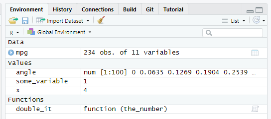

# Functions! Functions everywhere! {#functions}

```{r message=FALSE, warning=FALSE, include=FALSE}
library(glue)
library(tidyverse)
```

In this chapter you will learn about _functions_ in R, as they are the second most important concept in R and are everywhere (just like vectors and lists). You will also learn how to _pipe_ your computation through series of functions without creating a mess of temporary variables or nested calls. Don't forget to download the [notebook](notebooks/Seminar 04 - functions.Rmd).

## Functions
In the previous chapters, you have learned that you can store information in variables — "boxes with slots" — as [vectors](#vectors) or as [tables](#tables) (bundles of vectors of equal length). To use these stored values for computation you need functions. In programming, function is an _isolated_ code that receives some input, performs some action on it, and, optionally, returns a value^[Function that does not return a value, probably, generates its output to a console, external file, etc. There is little point in running a function that does not affect the world.]. The concept of functions comes from mathematics, so it might be easier to understand them using R implementation of mathematical functions. For example, you may remember a sinus function from trigonometry. It is typically abbreviated as `sin`, it takes a numeric value of angle (in radians) as its _input_ and returns (this is its _output_) a corresponding value  between -1 and 1: $sin(0) = 0$, $sin(\pi/2) = 1$, etc.

```{r echo=FALSE, fig.align="center", message=FALSE, warning=FALSE}
angle <- seq(0, 2*pi, length.out = 100)

ggplot(data=NULL, aes(x=angle, y=sin(angle))) + 
  geom_line() + 
  geom_point(aes(x = c(0, pi/2), y=sin(c(0, pi/2)))) + 
  scale_x_continuous(breaks = c(0, pi/2, pi, 3*pi/2, 2*pi),
                     labels = c(0, expression(pi~"/2"), expression(pi), expression("3"~pi~"/2"), expression("2"~pi)))
```

In R, you write a function using the following template
```r
name_of_the_function <- function(parameter1, parameter2, parameter3, ...){
  ...some code that computes the value...
  return(value);
}
```
A `sin` function with a single parameter `angle` would look something like this
```r
sin <- function(angle){
  ...some math that actually computes sinus of angle using value of angle parameter ...
  return(sin_of_angle);
}
```

Once we have the function, we can use it by _calling_ it. You simply write `sin(0)`^[I've cheated here by using R implementation of [sin()](https://stat.ethz.ch/R-manual/R-devel/library/base/html/Trig.html).] and get the answer!
```{r}
sin(0)
```

As you hopefully remember, all simple values are vectors, so instead of using a scalar `0` (merely a vector of length of one) you can write and apply this function to (compute sinus for) every element in the vector.
```{r}
sin(seq(0, 3.141593, length.out = 5))
```

You can think of functions parameters as local function variables those values are set before the function is called. A function can have any number of parameters, including zero^[This, probably, means that the function always does the same thing or a random thing and you cannot influence this.], one, or many parameters. For example, an arctangent [atan2](https://stat.ethz.ch/R-manual/R-devel/library/base/html/Trig.html) function takes 2D coordinates (`y` and `x`, in that order!) and returns a corresponding angle in _radians_.
```{r}
atan2(c(0, 1), c(1, 1))
```

A definition of this function would look something like this
```{r eval=FALSE}
atan2 <- function(y, x){
  ...magic that uses values of y and x parameters...
  ...to compute the angle_in_rad value...
  return(angle_in_rad);
}
```

::: {.infobox .practice}
Do exercise 1.
:::

## Writing a function
Let us start practicing computing things in R and writing functions at the same time. We will begin by implementing a very simple function that doubles a given number. We will write this function in steps. First, think about how you would name^[`double_or_nothing`?] this function (meaningful names are your path to readable and re-usable code!) and how many parameters it will have. Write the definition of the function without any code inside of wiggly brackets (so, no actual computation or a return statement at the end of it).

::: {.infobox .practice}
Do exercise 2.1
:::

Next, think about the code that would _double-the-value_ based on the parameter. This is the code that will eventually go inside the wiggly brackets. Write that code (just the code, without the bits from exercise 2.1) in exercise 2.2 and test it by creating a variable with the same name as your parameter inside the function. E.g., if my parameter name is `the_number`, I would test it as
```{r eval=FALSE}
the_number <- 1
...my code to double the value usign the_number variable...
```
::: {.infobox .practice}
Do exercise 2.2
:::

By now you have your formal function definition (exercise 2.1) and the actual code that should go inside (exercise 2.2). Now, we just need to combine them by putting the code inside the function and _returning_ the value. You can do this two ways: 

1) you can store the results of the computation in a separate local variable and then return that variable,
2) return the results of the computation directly
```
# 1) first store in a local variable, then return it
  result <- ...some computation you perform...
  return(result);

# 2) returning results of computation directly
  return(...some computation you perform...);
```
Do it _both_ ways in exercises 2.3 and 2.4. Call the function using different inputs to test that it works.

::: {.infobox .practice}
Do exercise 2.3 and 2.4
:::

More practice is always good, so write a function that converts an angle in _degrees_ to _radians_. The formula^[Hint: [Constants](https://stat.ethz.ch/R-manual/R-devel/library/base/html/Constants.html)] is
$$rad = \frac{deg \cdot \pi}{180}$$
Decide whether you want to a have an intermediate local variable inside the function or to return the results of the computation directly.

::: {.infobox .practice}
Do exercise 3
:::

## Scopes: Global versus Local variables
I suggested that you use a variable to store the results of double-it-up computation before returning it. But why did I call it _local?_ This is because each function has it own _scope_ (environment with variables and functions) that is (mostly) independent from the scope of the global script. Unfortunately, environment scopes in R are different and more complicated than those in other programming languages, such Python, C/C++, or Java, so always pay attention and be careful in the future.

The _global_ scope/environment is the environment for the code _outside_ of functions. All _global_ variables and functions, the ones that you define in the code _outside_ of functions (typing in the console, running scripts, running chunks of code in notebooks, etc.), live where. You can see what you have in the global scope at any time by looking at _Environment_ tab (note the _Global Environment_ tag).
```{r echo=FALSE, out.width = "70%", fig.align = 'center'}

```

In my case, it has one table (`mpg`, all tables go under _Data_), three vectors (`angle`, `some_variable`, and `x`, all vectors go under `Values`), and an example function from exercise #2 that I created (`double_it`, all functions go under _Functions_, makes sense). However, it has no access to parameters of the functions and variables that you define inside these function. When you run a function, it has it own scope/environment that includes _parameters_ of the function (e.g., `the_number` for my `double_it` function and the value it was assigned during the call), any _local_ variables you create inside that function (e.g., `result <- ...some computation you perform...` creates such local variable), and a **copy(!)** of all _global_ variables^[You can write to a parent (e.g., global) environment from inside the function via [<<-](https://stat.ethz.ch/R-manual/R-devel/library/base/html/assignOps.html) operator. However, this should be your last resort, as it makes the code brittle and harder to understand and debug, because if depends not only on local things but on global variables that may or may not be where at any given moment.]. In the code below, take a look at the comments that specify the accessibility of variables between global script and functions (ignore [glue](https://glue.tidyverse.org/reference/glue.html) for a moment, it _glues_ a variable's value into the text, so I use it to make printouts easier to trace)^[These rules — a **copy** of a global scope is accessible inside a function but function scope is inaccessible from outside — should be how _you_ write your code. However, R's motto is "anything is possible", so be aware that _other people_ may not respect these rules. This should not be an issue most of the time but if you are curious how R can let you break all rules of good responsible programming and do totally crazy things, read [Advanced R](https://adv-r.hadley.nz/) book by Hadley Wickham. However, it is really **advanced**, aimed primarily at programmers who develop R and packages, not at scientists who use them.]

```{r}
# this is a GLOBAL variable
global_variable <- 1

i_am_test_function <- function(parameter){
  # parameter live is a local function scope
  # its values are set when you call a function
  print(glue("  parameter inside the function: {parameter}"))
  
  # local variable created inside the function
  # it is invisible from outside
  local_variable <- 2
  print(glue("  local_variable inside the function: {local_variable}"))
  
  # here, a_global_variable is a LOCAL COPY of the the global variable
  # of the same name. You can use this COPY
  print(glue("  COPY of global_variable inside the function: {global_variable}"))
  
  # you can modify the LOCAL COPY but that won't affect the original!
  global_variable <- 3
  print(glue("  CHANGED COPY of global_variable inside the function: {global_variable}"))
}

print(glue("global_variable before the function call: {global_variable}"))

i_am_test_function(5)

# the variable outside is unchanged because we modify its COPY, not the variable itself
print(glue("UNCHANGED global_variable after the function call: {global_variable}"))
```

::: {.infobox .practice}
Do exercise 4 to build understanding of scopes.
:::

## Function with two parameters
Let us write a function that takes _two_ parameters — `x` and `y` — and computes _radius_ (distance from `(0,0)` to `(x, y)`)^[This function is complementary to `atan2()`, as two of them allow transformation of coordinates from Cartesian to polar coordinate system]. The formula is 
$$R = \sqrt{x^2 + y^2}$$
This is very similar to exercises 2 and 3, with number of parameters being the only difference.

::: {.infobox .practice}
Do exercise 5.
:::

## Table as a parameter
So far, we only passed vectors (a.k.a. values) to functions but you can pass any object including tables^[And even functions themselves, not just what they computed! This is part of _functional programming_ you will learn about later.]. Let us use [mpg](https://ggplot2.tidyverse.org/reference/mpg.html) table from the _ggplot2_ package. Write a function that takes a table as a _parameter_. This mean that the function should not assume that a table with this name exists in the global environment. Do not use `mpg` as a parameter name (makes it confusing and hard to understand which table global or local you actually mean), call it something else^[I tend to use `df`, if it is reasonably easy to deduce what sort of `data.frame` I mean.]. The function should compute and return average miles-per-gallon efficiency based on city `cty` and highway `hwy` test cycles. Do it in _two_ ways. First, compute and return _a vector_ based on the table passed as parameter. Second, do the same computation but add the result _to the table that function received as a parameter_ (call the new column `avg_mpg`) and return the entire table (remember, modifying table is not enough, as you are working _on a copy_).

::: {.infobox .practice}
Do exercise 6.
:::

Let us write another function that computes [mean](https://stat.ethz.ch/R-manual/R-devel/library/base/html/mean.html) efficiency for a particular cycle, either city or highway. For this, the function will take _two_ parameters: 1) the table itself and 2) a string (text variable) with the name of the column. Then, you use it to access the column via simplifying `[[]]` [subsetting](#subsetting). To summarize, your function takes 1) a table and 2) a string with a column name and returns a single number (mean for the specified column). E.g.
```r
average_efficiency(mpg, "cty") # should return 16.85897
```
::: {.infobox .practice}
Do exercise 7.
:::

## Named versus positional arguments
Remember than we talked about the [assignment statement](#assignment-statement), I noted that you should always use [<-](https://stat.ethz.ch/R-manual/R-devel/library/base/html/assignOps.html) operator for assignments but warned you that you will encounter an alternative `=` operator when we will use functions. You also may have notice me using it, for example, in `seq(0, 2*pi, length.out = 100)`. Why did I use name for the third parameter and not the other two? Why did I have to use `length.out=` at all? This is because in R you can pass arguments by _position_ (first two arguments in that example) or by _name_ (that would be `length.out=`).

Then you pass arguments by _position_, values are put into corresponding arguments in the order you supplied them in. I.e., the first value goes into the first parameter, the second into the second etc. Then you specify arguments by _name_, you explicitly state which argument gets which value `arg = value`. Here, the exact order does not matter and you can put arguments in the order you need (i.,e., an order that makes understanding the code easier). You can also mix these two ways and, R being R, you can really mix them interleaving positional and named arguments any way you like^[That being a case, never use named argument before positional ones. Each time you use a named argument, its position is taken out and that _changes_ position index for remaining positional arguments. This is an almost certain way to put a value into a wrong parameter and, at the same time, create an error that is really hard to find.]. Despite all the flexibility that R gives you to confuse yourself and others, use only all-positional-followed-by-all-named-arguments order, e.g., `seq(0, 2*pi, length.out = 100)`.

When should you use which? That depends solely on which way is clearer or possible. For a single parameter or widely used mathematical functions, like [mean](https://stat.ethz.ch/R-manual/R-devel/library/base/html/mean.html) or [sin](https://stat.ethz.ch/R-manual/R-devel/library/base/html/Trig.html) there is little point in using names (particularly, because the only argument is named `x`). At the same time, I _always_ use named parameters for [atan2](https://stat.ethz.ch/R-manual/R-devel/library/base/html/Trig.html) simply because I am never 100% sure about the order (i.e., `x` followed by `y` occurs far more often). At the same time, formulas for statistical models in R have a very specific look and are typically a first argument, so it is probably redundant to specify that `formula = y ~ x`.Returning to the [seq()](https://stat.ethz.ch/R-manual/R-devel/library/base/html/seq.html) function, the `length.out` is actually its _fourth_ argument with `by` (an alternative way to define how many values you will get in the sequence) being third. But because both parameters define, essentially, the same thing, it is _impossible_ to specify `length.out` using positional arguments only. Finally, if a function has more than a couple of parameters, it is probably a good idea to use named arguments. In short, use you own better judgement on whatever makes understanding the code easier.

::: {.infobox .practice}
Do exercise 8.
:::


## Default values
When you write a function, you can combine simplicity of its use with flexibility via _default values_. I.e., _some_ parameters can have sensible or commonly used values but, if desired, a user can specify their own values to modify functions behavior. For example, function  [mean](https://stat.ethz.ch/R-manual/R-devel/library/base/html/mean.html) has _three_ parameters. You always need to specify the first one (`x`, a vector of values you are computing the mean of). But you can also specify trimming via `trim` and whether it should ignore `NA` via `na.rm`^[If you do not ignore `NA` then the mean of a vector with at least one `NA` in it is `NA` as well]. By default, you do not trim (`trim = 0`) and do not ignore `NA` (`na.rm = FALSE`). These defaults are sensible as they produce a most typically expected behavior. At the same time their existence means that you can fine-tune your mean computation the way you require.

When writing you own function, you simply specify the default values when you define an argument. E.g., here, the second parameter `r`, the radius, has a default value of 1, so you can only specify the direction of the vector to compute (x, y)  coordinates for a (default) _unit_ vector.
```{r eval=FALSE}
polar_to_cartesian <- function(angle, r=1) {
  # ...
}
```

::: {.infobox .practice}
Do exercise 9.
:::

## Nested calls
What if you need to call several functions in a single chain to compute a result? Think about the function from exercise #3 that converts degree to radians. Its most likely usage scenario is to convert degrees to radians and use that to compute sinus (or some other trigonometric function). There are different ways you can do this. For example, you can store the angle in radians in some temporary variable (e.g., `angle_in_radians`) and then pass it to sinus function during the next call.
```r
angle_in_radians <- deg2rad(90) # function returns 1.570796, this value is stored in angle_in_radians
sin(angle_in_radians) # returns 1
```

Alternatively, you can use the value returned by `deg2rad()` _directly_ as a parameter for function `sin()`
```r
sin(deg2rad(90)) # returns 1
```

In this case, the computation proceeds in an _inside-out_ order: The innermost function gets computed first, the function that uses its return value is next, etc. Kind of like assembling a Russian doll: you start with an innermost, put it inside a slightly bigger one, now take that one put it inside the next, etc. Nesting means that you do not need to pollute you memory with temporary variables^[The worst case scenario is when you use same `temp` variable for things like that, forget to initialize / change its value properly at some point, spend half-a-day trying to understand why your code does not generate an error but results don't make sense.] and make your code more expressive as nesting explicitly informs the reader that intermediate results are of no value by themselves and are not saved for later use.

::: {.infobox .practice}
Do exercise 10.
:::

## Piping {#pipe}
Although nesting is better than having tons of intermediate variables, lots of nesting can be mightily confusing. Tidyverse has an alternative way to chain or, in Tidyverse-speak, [pipe](https://magrittr.tidyverse.org/reference/pipe.html) a computation through a series of function calls. The magic operator is `%>%` (that's the pipe) and here is how it transforms our nested call
```r
sin(deg2rad(90)) # returns 1

deg2rad(90) %>% sin() # also return 1

90 %>% deg2rad() %>% sin() # also returns 1
```

::: {.infobox .practice}
Do exercise 11.
:::

All functions you used in the exercise had only one parameter because `single-output %>% single-input` piping is very straightforward. But what if one of the functions takes more than one parameter? By default, `%>%` puts the piped value into the _first_ parameter. Thus `4 %>% radius(3)` is equivalent to `radius(4, 3)`. Although this default is very useful (the entire Tidyverse is build around this idea of piping a value into the _first_ parameter to streamline your experience), sometimes you need that value as some _other_ parameter (e.g., when you are pre-processing the data before piping it into a statistical test, the latter typically takes `formula` as the first parameter and `data` as second). For this, you can use a special dot variable: `.`, which is a hidden^[As in: It won't show up in your Global Environment tab.] temporary variable that holds the value you are piping through via `%>%`^[Yes, it is the same variable that you use over-and-over again but [magrittr](https://magrittr.tidyverse.org/articles/magrittr.html) package makes sure to clean it up after each call, so you are not in danger of incidentally using a value from a previous call.]. Thus,
```r
z <- 4
w <- 3
z %>% radius(w) # is equivalent to radius(z, w)

# Note the dot!
z %>% radius(., w) # is equivalent to radius(z, w)
z %>% radius(w, .) # is equivalent to radius(w, z)
```

You can use the dot with named parameters as well
```r
w %>% radius(z, y=.)
```

Note that because `.` is a variable, you can use it several times just as you can use any variable several times
```r
4 %>% radius(., .) # is equivalent to radius(4, 4)
```

::: {.infobox .practice}
Do exercise 12.
:::

## Function is just a code stored in a variable
Did you spot the assignment `<-` operator in function definitions and wondered about this? Yes, this means that you are literally storing a function code in a variable. So when you call this function by name, you are asking to run the code stored inside that variable. You can appreciate that fact by typing a name of a function you wrote _without_ round brackets, e.g. `double_the_value` or `radius`, and, voila, you will see the code. This means that function name is not really a name (as in some other programming languages), rather it is a name of a variable it is stored in. So you can use a variable _with a function code inside_ just the way you treat any other variable. For example, you can copy it (do `radius2 <- radius` and then `radius2` will work exactly the same way), pass it as an argument of another function (effectively, copy its code into a parameter). This will be very handy when your learn about bootstrapping (needs data and a function) or about [applying ](https://stat.ethz.ch/R-manual/R-devel/library/base/html/apply.html)/[mapping](https://purrr.tidyverse.org/) functions to data.

## Functions! Functions everywhere!
_Every_ computation you perform in R is implemented as a function, even if it does not look like a function call. For example, `+` addition operation is a function. Typically, you write `2 + 3`, so no round brackets, no comma-separated list of parameters, it looks different. But this is just a special implementation of a function call (known as [function operator](http://adv-r.had.co.nz/Function-operators.html)) that makes code more readable for humans. You can actually call `+` function the way you call a normal function by using backticks around its name.
```{r}
2 + 3

# note the `backticks` around +
`+`(2, 3)
```

Even the assignments operator `<-` is, you've guessed it, a function
```{r}
`<-`(some_variable, 1)
some_variable
```

This does not mean that you should start using operators as functions (although, if it helps to make a particular code clearer, then, why not?), merely to stress that there is only one way to program any computation in R —-- as a function —-- regardless of how it may appear in the code. Later on, you will learn how to [apply](https://stat.ethz.ch/R-manual/R-devel/library/base/html/apply.html) functions to vectors or tables (or, a Tidyversion of that, how to use functions to [map](https://purrr.tidyverse.org/) inputs to outputs), so it helps to know that you can apply _any_ function, even the one that does not look like a function.

## Using (or not using) explicit return statement
In the code above I have always used the [return](https://stat.ethz.ch/R-manual/R-devel/library/base/html/function.html) function. However, explicit `return(some_value)` can be omitted if it is the _last_ line in a function, you just write the value (variable) itself:
```{r}
some_fun <- function(){
  x <- 1
  return(x)
}

some_other_fun <- function(){
  x <- 2
  x
}

yet_another_fun <- function(){
  3
}

some_fun()
some_other_fun()
yet_another_fun()
```

The lack of `return` function in the final line is actually an [officially recommended style of Tidyverse](https://style.tidyverse.org/functions.html) but I am wary of this approach because "explicit is better than implicit". This omission may be reasonable if it comes at the very end of a long pipe but, in general, I would recommend using `return()`.
