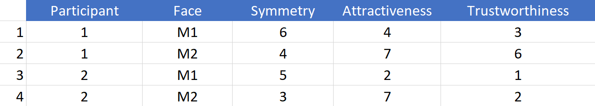
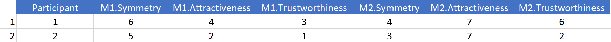
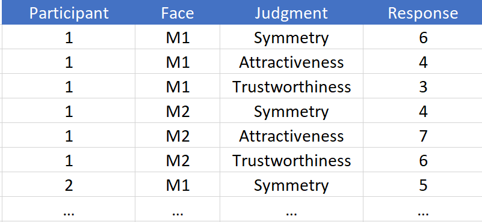

# Grammar of Graphics {#ggplot2-seminar}

In previous seminar, you have learned about tables, which are the main way of representing data in psychological research and in R. In the following seminars, you will learn how to manipulate the data in these tables: change it, aggregate or transform individual groups of data, use it for statistical analysis. But before that you need to understand how to store your data in the table in the optimal way. First, I will introduce the idea of _tidy data_, the concept that gave [Tidyverse](https://www.tidyverse.org/) its name. Next, we will see how tidy data helps you visualize the relationships between variables. Don't forget to download the [notebook]().

## Tidy data {#tidydata}
The tidy data follows [three rules](https://r4ds.had.co.nz/tidy-data.html):

* variables are in columns,
* observations are in rows,
* values are in cells.

This probably sound very straightforward to the point when you wonder "Can a table not by tidy?" As a matter of fact _a lot_ of typical results of psychological experiments are not tidy. Imagine an experiment where participants rated a face based on symmetry, attractiveness, and trustworthiness. Typically (at least in my experience), the data will stored as follows:
```{r echo=FALSE, out.width = "80%", fig.align = 'center'}

```

This is a very typical table optimized for _humans_. I single row contains all responses about a single face, so it is easy to visually compare responses of individual observers. Sometimes, the table is even wider so that a single row holds all responses from a single observer (in my experience, a lot of online surveys produce data in this format).
```{r echo=FALSE, out.width = "100%", fig.align = 'center'}

```

So, what is wrong with it? Don't we have variables in columns, observations in rows, and values in cells? Not really. You can already see it when comparing the two tables above. The _face_ identity is a variable, however, in the second table it is hidden in column names. Some columns are about face `M1`, other columns are about `M2`, etc. So, if you are interested in analyzing symmetry judgments across all faces and participants, you will need to select all columns that end with `.Symmetry` and figure out a way to extract the face identity from columns' names. Thus, face _is_ a variable but is not a column in the second table. 

Then, what about the first table, which has `Face` as a column, is it tidy? The short answer: Not really but that depends on your goals as well! In the experiment, we collected _responses_ (these are numbers in cells) about different type of _judgments_. The latter are a variable but is hidden in column names. Thus, a _tidy_ table for this data would be
```{r echo=FALSE, out.width = "100%", fig.align = 'center'}

```

This table is very tidy and it makes it easy to group data by every different combination of variables (e.g. per face and judgment, per participant and judgment, etc.). However, it may not always be necessarily the best way to represent the data. For example, if you would like to model `Trustworthiness` using `symmetry` and `attractiveness` as predictors, when the first table is more suitable. Thus, table structure must fit your needs, not the other way around. Still, what you want is a _tidy_ table because it is best suited for most things you will want to do with the data and because it makes it easy to transform the data to match your specific needs (e.g., going from the third table to the first one via pivoting).

Most data you will get from experiments will not be tidy. We will spent quite some time in learning how to tidy it up but first let us see how an already tidy data makes it easy to visualize relationships in it.

## Grammar of Graphics, a.k.a. _ggplot2_ {#ggplot2}
[ggplot2](https://ggplot2.tidyverse.org/) package is my main tool for visualizations in R. Its advantage is an approach of describing a plot that is conceptually different from most other software, e.g. Matlab,  Matplotlib in Python, etc. Another reason to use ggplot2 is it tends to make really good looking production-ready plots (this is not a given, a default-looking Matlab plot is pretty ugly) as Hadley Wickham was heavily influenced by works of [Edward Tufte](https://www.edwardtufte.com/tufte/). This aspect goes beyond our seminar (although, if you are interested, I might make a Christmas-special on that) but if you will need to visualize data in the future, I strongly recommend reading Tufte's books. In fact, it is such an aesthetically pleasing experience that I would recommend reading them in any case.

Getting back to _ggplot2_. A plot in _ggplot2_ is described in three parts:

1. Relationship between data and visual properties of the plot (which variables map on axes, color, size, fill, etc.).
2. Geometrical primitives that visualize your data (points, lines, error bars, etc.).
3. Additional properties of the plot (scaling of axes, labels, annotations, etc.)

You always need the first one. But you do not need to specify the other two, even though a plot without geometry in it looks very empty. Let us start with a very simple artificial example table below.
```{r echo=FALSE, message=FALSE, warning=FALSE,  fig.align="center"}
library(tidyverse)
simple_tidy_data <- 
  expand.grid(Condition = c("A", "B", "C"), Intensity = 1:8) %>%
  mutate(Response = rnorm(n(), 1, 0.2) + rnorm(n(), as.numeric(as.factor(Condition)), 0.2) * 2 + rnorm(n(), Intensity, 0.4))

knitr::kable(simple_tidy_data)
```

We plot it with `Intensity` as x-axis, `Condition` as color (this also means that data is grouped by color), and `Response` as y-axis.
```{r}
ggplot(data=simple_tidy_data, aes(x = Intensity, y = Response, color=Condition)) + 
  geom_line()
```
As I already wrote, technically, you do not need the geometry `+geom_line()` bit, so let us drop it and compare the plots.
```{r fig.align = 'center'}
ggplot(data=simple_tidy_data, aes(x = Intensity, y = Response, color=Condition))
```
Told you it will look empty and yet you can already see _ggplot2_ in action. Notice that axes are already labeled and their limits are already set. You cannot see the legend (they are not plotted without geometry) but it is also ready. This is because our initial call specified the most important part: _how_ the individual variables map on various properties of the plot even before we know which visuals we will use to plot the data. When we specified that x-axis will represent the `Intensity` ggplot2 figured out the range of values, so it knows just _where_ it is going to plot whatever we decide to plot. Whether points, lines, bar, error bars and what not will span only that range. Same goes for other properties such as color. We wanted _color_ to represent the number condition. Again, we may not know what exactly we will be plotting (points, lines?) or even how many different things we will be putting on the plot (points + lines? points + lines + linear fit?) but we do know that whatever visual we add, if it can have color, its color _must_ depict condition for that data point. The beauty of ggplot2 is that it analyses your data and figures out how many colors you need and is ready to consistently apply them to any visual you will later add It will ensure that all points, bars, lines, etc. will have consistent coordinates scaling, color-, size-, fill-mapping that are the same across the entire plot. This may sound trivial but typically (e.g., Matlab, Matplotlib), it is _your_ job to make sure that all these properties match and that they represent the same value across all visual elements. And it is a pretty tedious job, particularly when you decide to change your mapping and have to redo all individual components by hand. In ggplot2, this dissociation between mapping and visuals means you can tinker with one of them at a time. E.g. keep the visuals but change grouping or see if condition is easier to via shape or line type, size of the point? Or you can keep the mapping and see whether adding another visual will make the plot clearer. As noted, the mapping also _groups_ your data, so when you use group-based visual information (e.g. a linear regression line) it will know what data belongs together and so will perform this computation per group. 

Let us see how you can keep the relationship mapping but play with visuals. Let us have both lines and points.
```{r fig.align = 'center'}
ggplot(data=simple_tidy_data, aes(x = Intensity, y = Response, color=Condition)) + 
  geom_line() +
  geom_point() # this is new!
```

Just to be clear, we _kept_ the relationship between variables and properties but said "Oh, and throw in some points please". And ggplot2 knows how the points are group, where should they appear and which colors they must have. But we want more!
```{r fig.align = 'center'}
ggplot(data=simple_tidy_data, aes(x = Intensity, y = Response, color=Condition)) + 
  geom_line() +
  geom_point() +
  geom_smooth(method="lm", se=FALSE, linetype="dashed") # a linear regression over all dots in the group
```
Now we added a linear regression line that helps us to see just how linear the relationship between `Intensity` and `Response` is. Again, we simply wished for another visual (`method="lm"` means that we wanted to average data via linear regression, `se=FALSE` means no standard error stripe, `linetype="dashed"` just makes it easier to distinguish from the solid data line).

Or, we can keep the _visuals_ but see whether swapping mapping between `Condition` and `Intensity` would be more interesting (we need to specify `group=Intensity` as continuous data is not grouped automatically).
```{r fig.align = 'center'}
ggplot(data=simple_tidy_data, aes(x = Condition, y = Response, color=Intensity, group=Intensity)) + 
  geom_line() +
  geom_point() +
  geom_smooth(method="lm", se=FALSE, linetype="dashed") # a linear regression over all dots in the group
```
Or, we can check whether splitting into several plots helps.
```{r fig.align = 'center'}
ggplot(data=simple_tidy_data, aes(x = Intensity, y = Response, color=Condition)) + 
  geom_line() +
  geom_point() +
  geom_smooth(method="lm", se=FALSE, linetype="dashed") +
  facet_grid(. ~ Condition)
```
Again, note that all three plots live on the same scale for x- and y-axis, making them easy to compare (you fully appreciate this magic if you ever struggled with ensuring consistent scaling by hand in Matlab). I went through so many examples to stress how you can _think_ about the mapping and visuals independently. And I hope you can see how this makes it easy to think either about _which_ relationships you want to show or _how_ you want to show them.

